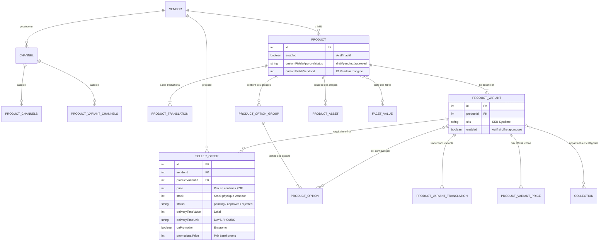

# 📘 Architecture & Guide Détaillé : Processus d'Ajout de Produits, Liaisons et Canaux (Channels) sur AHIZAN

---

## 📑 Sommaire
1. [Vue d'ensemble de la modélisation Catalogue](#1-vue-densemble-de-la-modélisation-catalogue)
2. [Cartographie des Entités et Tables en Base de Données](#2-cartographie-des-entités-et-tables-en-base-de-données)
3. [Processus Étape par Étape : Du Formulaire Vendeur à la BDD](#3-processus-étape-par-étape--du-formulaire-vendeur-à-la-bdd)
4. [Le Mécanisme des Canaux (Channels) et l'Isolation Vendeur](#4-le-mécanisme-des-canaux-channels-et-lisolation-vendeur)
5. [Le Cycle de Validation (Cockpit Admin) et Synchronisation Vitrine](#5-le-cycle-de-validation-cockpit-admin-et-synchronisation-vitrine)
6. [Architecture Multi-Offres (Buy Box & Greffe de Variantes)](#6-architecture-multi-offres-buy-box--greffe-de-variantes)
7. [Diagramme Relationnel et Flux de Données](#7-diagramme-relationnel-et-flux-de-données)

---

## 1. Vue d'ensemble de la modélisation Catalogue

Sur AHIZAN, la modélisation du catalogue dépasse le cadre d'une boutique mono-vendeur classique. Elle sépare rigoureusement la **définition générique du produit** de l'**offre commerciale proposée par un vendeur**.

```
┌───────────────────────────────────────────────────────────────┐
│                 PRODUCT (Fiche Produit Maître)                │
│   • Titre / Description / Slug / Médias                       │
│   • Catégories (Collections) & Filtres (FacetValues)          │
│   • Poids / Dimensions                                        │
└───────────────────────────────┬───────────────────────────────┘
                                │
               ┌────────────────┴────────────────┐
               ▼                                 ▼
┌───────────────────────────────┐ ┌───────────────────────────────┐
│   PRODUCT VARIANT 1 (Noir-M)  │ │   PRODUCT VARIANT 2 (Noir-L)  │
│   • SKU Système (AHZ-...)     │ │   • SKU Système (AHZ-...)     │
│   • Options (Taille/Couleur)  │ │   • Options (Taille/Couleur)  │
└──────────────┬────────────────┘ └──────────────┬────────────────┘
               │                                 │
     ┌─────────┴─────────┐             ┌─────────┴─────────┐
     ▼                   ▼             ▼                   ▼
┌──────────────┐  ┌──────────────┐┌──────────────┐  ┌──────────────┐
│ SELLER OFFER │  │ SELLER OFFER ││ SELLER OFFER │  │ SELLER OFFER │
│  Boutique A  │  │  Boutique B  ││  Boutique A  │  │  Boutique C  │
│  Prix: 10000 │  │  Prix: 9500  ││  Prix: 12000 │  │  Prix: 11800 │
│  Stock: 15   │  │  Stock: 3    ││  Stock: 8    │  │  Stock: 20   │
└──────────────┘  └──────────────┘└──────────────┘  └──────────────┘
```

---

## 2. Cartographie des Entités et Tables en Base de Données

Pour comprendre comment les éléments sont physiquement reliés, voici les tables PostgreSQL impliquées :

| Entité Vendure / Ahizan | Table BDD | Rôle et Relations |
| :--- | :--- | :--- |
| **`Product`** | `product`, `product_translation` | Fiche maître. Liée à `customFieldsVendorid` (ID du vendeur initiateur) et `customFieldsApprovalstatus` (`draft`, `pending`, `approved`, `rejected`). |
| **`ProductOptionGroup`** | `product_option_group`, `product_option_group_translation` | Groupe d'attributs (ex: *Couleur*, *Pointure*, *Capacité*). |
| **`ProductOption`** | `product_option`, `product_option_translation` | Valeur d'attribut (ex: *Bleu*, *XL*, *128 Go*). Liée à son groupe par `productOptionGroupId`. |
| **`ProductVariant`** | `product_variant`, `product_variant_translation`, `product_variant_price` | La déclinaison réelle achetable. Liée à `productId` et à la table de jointure `product_variant_options_product_option`. |
| **`SellerOffer`** | `seller_offer` | L'offre marchande. Clés étrangères directes : `vendorId` (vers `vendor.id`) et `productVariantId` (vers `product_variant.id`). Porte le prix, le stock, la promo et le délai de livraison. |
| **`Collection`** | `collection`, `collection_translation` | Catégories de navigation. Liées aux variantes via `collection_product_variants_product_variant`. |
| **`FacetValue`** | `facet_value`, `facet_value_translation` | Tags et filtres de recherche. Liés au produit via `product_facet_values_facet_value`. |
| **`Asset`** | `asset` | Images et médias. Liés via `product_assets_asset` et `product.featuredAssetId`. |
| **`Channel`** | `channel` | Canaux d'isolation multi-tenant. Tables de jointure : `product_channels_channel`, `product_variant_channels_channel`, `asset_channels_channel`. |

---

## 3. Processus Étape par Étape : Du Formulaire Vendeur à la BDD

Lorsqu'un vendeur clique sur **« Publier le produit »** sur le portail Seller, la mutation GraphQL `createMyProduct(input: CreateVendorProductInput!)` est déclenchée dans `vendor-shop.resolver.ts` :

```
       [Portail Vendeur]
               │
               ▼  Mutation GraphQL createMyProduct
       [Backend Ahizan]
               │
               ├─► 1. Identification & vérification du profil Vendor et de son Channel
               ├─► 2. Validation des prix minimaux & unicité des SKU
               ├─► 3. Création de la fiche Product (en statut 'pending', enabled = false)
               ├─► 4. Création/Association des ProductOptionGroups & ProductOptions
               ├─► 5. Génération des ProductVariants avec SKU système & SKU vendeur
               ├─► 6. Création des SellerOffers (Prix, Stock, Délais, Condition)
               ├─► 7. Affectation au Channel Privé du Vendeur (vendor-X-channel)
               ├─► 8. Association des Collections et Facettes
               └─► 9. Notification Push/Admin pour modération
```

### Détail pas à pas :

#### 1. Identification du Vendeur et du Canal
Le backend extrait le vendeur connecté via sa session (`myVendorProfile(ctx)`). Si le vendeur n'avait pas encore de canal dédié, `vendorService.ensureNativeSellerAndChannel` crée instantanément son `Seller` et son `Channel` privé.

#### 2. Création du `Product` maître
Un enregistrement est inséré dans `product` et `product_translation` avec :
- `enabled = false` (le produit n'est pas encore visible sur la vitrine publique).
- `customFields.approvalStatus = 'pending'` (en attente de revue admin).
- `customFields.vendor = vendor.id`.
- Les tags facettes (`finalFacetValueIds`) extraits des catégories sélectionnées.

#### 3. Gestion dynamique des Déclinaisons (Options & Variantes)
- Si le produit a des options (ex: Tailles S, M, L) : le backend crée ou réutilise les `ProductOptionGroup` (*Taille*) et les `ProductOption` (*S*, *M*, *L*) dans le catalogue.
- Pour chaque combinaison, un `ProductVariant` est généré avec un SKU unique système (`AHZ-PRD-...`) et le SKU de la boutique (`vendorSku`).

#### 4. Création de la `SellerOffer`
Pour chaque variante créée, une ligne est insérée dans la table `seller_offer` :
- `productVariantId` = ID de la variante créée.
- `vendorId` = ID du vendeur.
- `price` = Prix fixé par le vendeur.
- `stock` = Quantité en stock du vendeur.
- `deliveryTimeValue` + `deliveryTimeUnit` = Délais annoncés (ex: 24h, 2 jours).
- `status` = `'pending'`.

#### 5. Affectation au Canal Vendeur
Le produit, ses variantes, ses options et ses images sont immédiatement affectés au **Channel du Vendeur** via :
- `product_channels_channel` (productId, vendorChannelId)
- `product_variant_channels_channel` (variantId, vendorChannelId)
- `asset_channels_channel` (assetId, vendorChannelId)

Grâce à cela, le vendeur retrouve immédiatement son produit dans la liste de ses articles sur son tableau de bord vendeur.

---

## 4. Le Mécanisme des Canaux (Channels) et l'Isolation Vendeur

Vendure fonctionne sur un modèle multi-tenant strict basé sur les **Channels**. AHIZAN exploite ce mécanisme pour garantir l'étanchéité totale entre les boutiques :

```
┌──────────────────────────────────────────────────────────────────────────┐
│                      CANAL PAR DÉFAUT (Channel ID 1)                     │
│                        "Ahizan Marketplace Vitrine"                      │
│                                                                          │
│   • Accessible par le Storefront Public (Clients)                        │
│   • Contient UNIQUEMENT les Produits et Variantes validés (APPROVED)     │
│   • Recherche globale 'search_index_item' synchronisée                   │
│   • Panier multi-vendeurs unifié                                         │
└─────────────────────────────────────┬────────────────────────────────────┘
                                      │
            ┌─────────────────────────┴─────────────────────────┐
            ▼                                                   ▼
┌──────────────────────────────────────┐    ┌──────────────────────────────────────┐
│     CANAL VENDEUR A (Channel ID 2)   │    │     CANAL VENDEUR B (Channel ID 3)   │
│         Token: vnd-token-alpha       │    │         Token: vnd-token-beta        │
│                                      │    │                                      │
│ • Produits du Vendeur A (même Draft) │    │ • Produits du Vendeur B              │
│ • Stock spécifique Vendeur A         │    │ • Stock spécifique Vendeur B         │
│ • Sous-commandes (SellerOrders) de A │    │ • Sous-commandes (SellerOrders) de B │
│ • Rôle Vendeur A (aucun accès à B)   │    │ • Rôle Vendeur B (aucun accès à A)   │
└──────────────────────────────────────┘    └──────────────────────────────────────┘
```

### Pourquoi ce découpage ?
1. **Sécurité et Confidentialité** : Un vendeur A ne peut ni voir, ni modifier les produits, les prix, les stocks ou les commandes du vendeur B.
2. **Paniers Mixtes Côté Client** : Le client fait ses achats sur le **Canal 1** sans se soucier du cloisonnement technique.
3. **Découpage Automatique des Commandes (`AhizanOrderSellerStrategy`)** :
   - Le client paie sa commande sur le Canal 1.
   - Le moteur découpe la commande en sous-commandes distinctes affectées aux Canaux respectifs des vendeurs.

---

## 5. Le Cycle de Validation (Cockpit Admin) et Synchronisation Vitrine

Tant qu'un produit est en statut `pending`, il n'est présent que dans le canal du vendeur et **n'apparaît pas** sur le site client (Canal 1).

### Le flux de validation :
```
[Vendeur soumet] ──► customFieldsApprovalstatus = 'pending'
                             │
                             ▼
                  [Admin Cockpit de Validation]
                             │
            ┌────────────────┴────────────────┐
            ▼                                 ▼
      [Rejeté ❌]                        [Approuvé ✅]
• Motif de rejet saisi              • customFieldsApprovalstatus = 'approved'
• Notification envoyée au vendeur   • SellerOffer.status = 'approved'
• Reste masqué de la vitrine        • ProductVariant.enabled = true
                                    • Liaison BDD au Channel 1 (Default)
                                    • Indexation instantanée dans search_index_item
```

### Que se passe-t-il lors de l'Approbation (`APPROVED`) ?
1. **Association au Canal 1** : Le produit et ses variantes sont ajoutés dans `product_channels_channel` et `product_variant_channels_channel` avec le `channelId = 1`.
2. **Calcul de la Buy Box** : Le prix minimum parmi toutes les offres approuvées est calculé et injecté dans `product_variant_price`.
3. **Synchronisation Search Index (`search_index_item`)** : L'index de recherche plein-texte est mis à jour immédiatement pour que le produit sorte dans les recherches, les catégories et les sections d'accueil du Storefront.

---

## 6. Architecture Multi-Offres (Buy Box & Greffe de Variantes)

Si un vendeur B souhaite vendre un produit déjà existant au catalogue :
1. Il n'a pas besoin de recréer une fiche produit doublon.
2. Il soumet une **`SellerOffer`** sur la variante existante avec son propre prix et son stock.
3. Dès validation :
   - Le Storefront affiche la fiche produit unique.
   - Le prix affiché par défaut est le **prix le plus compétitif (Meilleure Offre)**.
   - La page produit liste les autres offres disponibles ("Vendu aussi par Boutique B à X FCFA").

---

## 7. Diagramme Relationnel Complet des Données



---

## 📌 Synthèse des Points Clés

1. **Aucun mélange de données** : Grâce aux **Channels Vendure**, un vendeur n'interagit qu'avec son périmètre technique propre.
2. **Qualité du catalogue** : La séparation entre `Product` (fiche descriptive) et `SellerOffer` (condition commerciale) évite les doublons et assure une expérience client fluide de type marketplace internationale.
3. **Synchronisation automatique** : Dès qu'une offre ou un produit est validé par l'admin, les liaisons avec le **Canal 1** et l'index de recherche sont immédiatement activées.
