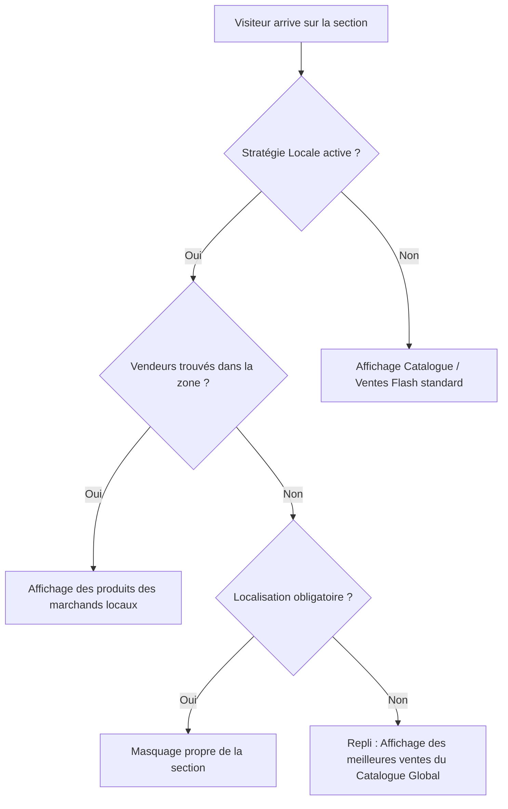

# 📘 Manuel Officiel : Collection de Produits EMS & Géolocalisation

Ce document détaille l'utilisation complète, les options de paramétrage, l'ensemble des combinaisons possibles et le rendu visuel exact attendu sur le Storefront pour le composant **« Collection de Produits EMS (Unifiée & Contexte Réactif) »** de la plateforme Ahizan.

---

## 📑 Sommaire
1. [Vue d'ensemble et Rôle du Composant](#1-vue-densemble-et-rôle-du-composant)
2. [Tableau de Référence des Paramètres](#2-tableau-de-référence-des-paramètres)
3. [Les 4 Piliers Fondamentaux](#3-les-4-piliers-fondamentaux)
   - [A. Stratégie d'Expérience (`experienceStrategy`)](#a-stratégie-dexpérience-experiencestrategy)
   - [B. Source Géographique (`locationSource`)](#b-source-géographique-locationsource)
   - [C. Mode de Sélection (`selectionMode`)](#c-mode-de-sélection-selectionmode)
   - [D. Mise en Page & Thèmes (`layout` & `cardTheme`)](#d-mise-en-page--thèmes-layout--cardtheme)
4. [Matrice Complète des Combinaisons & Résultats Visuels](#4-matrice-complète-des-combinaisons--résultats-visuels)
   - [Combinaison 1 : Découverte Hyperlocale Dynamique (Autour de moi)](#combinaison-1--découverte-hyperlocale-dynamique-autour-de-moi)
   - [Combinaison 2 : Hub Marché Physique Fixe (ex: Marché Dantokpa)](#combinaison-2--hub-marché-physique-fixe-ex-marché-dantokpa)
   - [Combinaison 3 : Ciblage de Ville / Quartier Fixe (ex: Cotonou / Cadjèhoun)](#combinaison-3--ciblage-de-ville--quartier-fixe-ex-cotonou--cadjèhoun)
   - [Combinaison 4 : Fil d'Accueil Intelligent & Anti-Saturation (Home Feed)](#combinaison-4--fil-daccueil-intelligent--anti-saturation-home-feed)
   - [Combinaison 5 : Tendances & Meilleures Promotions Locales](#combinaison-5--tendances--meilleures-promotions-locales)
   - [Combinaison 6 : Vente Flash avec Compte à Rebours & Jauge d'Urgence](#combinaison-6--vente-flash-avec-compte-à-rebours--jauge-durgence)
   - [Combinaison 7 : Sélection Editoriale Manuelle (Produits Vedettes)](#combinaison-7--sélection-editoriale-manuelle-produits-vedettes)
   - [Combinaison 8 : Vitrine Hybride (VIP Manuels + Remplissage Local)](#combinaison-8--vitrine-hybride-vip-manuels--remplissage-local)
   - [Combinaison 9 : Grille Multi-Onglets Réactive](#combinaison-9--grille-multi-onglets-réactive)
   - [Combinaison 10 : Ciblage Contextuel EMS (Règles Horaires & Territoriales)](#combinaison-10--ciblage-contextuel-ems-règles-horaires--territoriales)
5. [Logique de Repli Automatique (Résilience UX)](#5-logique-de-repli-automatique-résilience-ux)
6. [Guide de Dépannage & Bonnes Pratiques](#6-guide-de-dépannage--bonnes-pratiques)

---

## 1. Vue d'ensemble et Rôle du Composant

Le composant **Collection de Produits EMS** remplace tous les anciens modules de grilles fragmentés par un moteur unifié. Il connecte directement :
* Le moteur de géolocalisation spatiale **PostGIS (GeoEngine)**.
* Le catalogue de vendeurs multifournisseurs (**Multivendor Channel Engine**).
* Le moteur de règles contextuelles réactives (**Experience Management System - EMS**).
* Le système de cache mémoire ultra-rapide côté Storefront (**Client Cache**).

```
   ┌─────────────────────────────────────────────────────────────────┐
   │             CMS Universal Builder (Dashboard Vendure)           │
   │  [Stratégie] + [Source Geo] + [Sélection] + [Mise en Page/EMS]  │
   └───────────────────────────────┬─────────────────────────────────┘
                                   │  Publication Atomique (1 Clic)
                                   ▼
   ┌─────────────────────────────────────────────────────────────────┐
   │             Moteur Backend Vendure + PostGIS Spatial            │
   │   - Résolution hiérarchique : Ville → Arrondissement → Quartier │
   │   - Association Marché Physique ↔ Vendeurs Agréés               │
   └───────────────────────────────┬─────────────────────────────────┘
                                   │  Shop API GraphQL + Rules
                                   ▼
   ┌─────────────────────────────────────────────────────────────────┐
   │                 Storefront Next.js (Client Cache)               │
   │   - Détection position client ou quartier choisi                │
   │   - Rendu fluide instantané (Carousel / Grille / Badges)        │
   └─────────────────────────────────────────────────────────────────┘
```

---

## 2. Tableau de Référence des Paramètres

| Paramètre Builder | Type / Valeurs | Description & Rôle |
| :--- | :--- | :--- |
| **`experienceStrategy`** | `LOCAL_DISCOVERY` \| `HOME_FEED` \| `TRENDING` \| `FLASH_SALE` \| `CATALOG` | Cœur décisionnel du composant : définit l'algorithme de tri, de filtrage et de présentation des produits. |
| **`locationSource`** | `AUTO` \| `FIXED_MARKET` \| `FIXED_LOCATION` | Détermine comment la géolocalisation s'applique : dynamique selon le visiteur ou verrouillée sur un marché/quartier fixe. |
| **`radiusKm`** | `Number` (ex: `15` par défaut) | **Rayon de recherche GPS maximal en km**. Défini par le superadmin. Si laissé vide, la valeur optimale de **15 km** est appliquée pour garantir une séparation spatiale étanche entre les villes (ex: Cotonou vs Porto-Novo). |
| **`mixMode`** | `none` \| `hybrid` \| `fallback` | **Comportement si la zone est vide** : `none` (Strict, 0 mélange entre villes), `hybrid` (compléter avec d'autres vendeurs), `fallback` (catalogue général de secours). |
| **`marketId`** | `ID (ex: Marché Dantokpa, Ganhi)` | Actif si `locationSource = FIXED_MARKET`. Force l'affichage des boutiques de ce marché précis. |
| **`locationId`** | `ID (ex: Cotonou, Cadjèhoun)` | Actif si `locationSource = FIXED_LOCATION`. Force l'affichage des marchands de cette zone PostGIS (avec résolution récursive enfants/parents). |
| **`categoryFilterMode`** | `ALL` \| `SPECIFIC` | Mode de sélection des rayons : soit tout le catalogue, soit filtrage direct par rayons cochés. |
| **`collectionIds`** | `Array<ID>` | Liste directe des catégories/rayons sélectionnés via les tags interactifs du builder. |
| **`layout`** | `carousel` \| `grid-4` \| `grid-3` \| `compact` \| `list-split` | Format d'affichage sur la page (carrousel défilant ou grilles multi-colonnes). |
| **`columns`** | `3` \| `4` \| `5` \| `6` | Nombre de colonnes par ligne sur écran d'ordinateur. |
| **`cardTheme`** | `default` \| `flat` \| `glassmorphism` \| `neon` \| `bold-border` | Thème visuel haut de gamme des fiches produits. |
| **`headerStyle`** | `smart_cart` \| `standard` \| `bordered` | Style graphique de l'en-tête (Smart Cart avec badge, texte standard ou encadré). |
| **`badgeText`** | `String` (ex: *"⚡ Vente Flash"*, *"🛍️ Dantokpa"*) | Texte du badge placé au-dessus du titre. |
| **`badgeBgColor` / `badgeTextColor`** | Code Hex (ex: `#e31837`, `#ffffff`) | Couleurs de fond et de police du badge d'en-tête. |
| **`requireConfirmedLocation`** | `true` \| `false` | Si `true`, la section attend que le client confirme sa ville/quartier avant de s'afficher. |
| **`maxItemsPerVendor`** | `Number` (ex: `2` ou `3`) | Limite le nombre d'articles d'une même boutique pour garantir la diversité des marchands. |
| **`boostCertifiedVendors`** | `true` \| `false` | Remonte en tête de liste les commerçants vérifiés des marchés officiels. |
| **`topLeftBadge` ... `bottomRightBadge`** | `vendor_name`, `like_button`, `stock_status`, `cart_button`, etc. | Configuration des 4 badges situés aux 4 coins de chaque carte produit. |

---

## 3. Les 4 Piliers Fondamentaux

### A. Stratégie d'Expérience (`experienceStrategy`)
1. **`LOCAL_DISCOVERY` (Découverte Locale)** : Recherche les vendeurs actifs dans le périmètre géographique sélectionné et extrait leurs produits validés dans la limite du rayon `radiusKm`.
2. **`HOME_FEED` (Fil d'accueil)** : Combine la proximité avec un équilibrage intelligent pour éviter le monopole d'un vendeur et promouvoir les boutiques phares.
3. **`TRENDING` (Tendances & Promos)** : Trie les articles par remise promotionnelle décroissante.
4. **`FLASH_SALE` (Ventes Flash)** : Active l'urgence avec compte à rebours interactif.
5. **`CATALOG` (Catalogue pur)** : Affiche les collections standard selon les rayons choisis et l'ordre de tri (`LATEST`, `BEST_SELLERS`, `FEATURED`).

### B. Source Géographique & Rayon de Recherche
* **`AUTO` (Position Dynamique)** : Détecte automatiquement la position GPS du client. Applique le rayon `radiusKm` (15 km par défaut). Deux clients situés respectivement à Cotonou et Porto-Novo (distants de ~30 km) verront strictement des catalogues séparés sans fuite géographique.
* **`FIXED_MARKET`** : Choisit un marché réel (ex: *Marché Dantokpa*, *Marché Ganhi*, *Marché Missèbo*).
* **`FIXED_LOCATION`** : Choisit une zone géographique PostGIS (ex: *Cotonou*, *Porto-Novo*, *Abomey-Calavi*, *Cadjèhoun*). L'arbre hiérarchique récursif englobe automatiquement tous les sous-quartiers.

### C. Filtrage Direct par Rayons / Catégories
* **`Tous les rayons`** : Affiche l'intégralité des produits disponibles dans la zone sans restriction de catégorie.
* **`Filtrer par rayons spécifiques`** : Interface directe avec barre de recherche, cases à cocher et pastilles de tags interactives (`✓ Rayon ✕`). Suppression des menus complexes multi-étapes.

### D. Mise en Page & Thèmes (`layout` & `cardTheme`)
* **`carousel`** : Carrousel défilant fluide avec flèches de navigation.
* **`grid-4` / `grid-3` / `compact`** : Grilles réactives adaptées à tous les écrans.
* **Badges des 4 Coins** : Personnalisation libre de chaque coin de la carte produit (Nom vendeur, Bouton like, Statut du stock, Bouton Panier).

---

## 4. Matrice Complète des Combinaisons & Résultats Visuels

---

### Combinaison 1 : Découverte Hyperlocale Dynamique (Autour de moi)

* **Objectif** : Montrer à chaque visiteur les produits des marchands les plus proches de chez lui.
* **Paramètres CMS Builder** :
  ```json
  {
    "experienceStrategy": "LOCAL_DISCOVERY",
    "locationSource": "AUTO",
    "requireConfirmedLocation": false,
    "layout": "carousel",
    "cardTheme": "elevated",
    "title": "Produits à Proximité de Chez Vous",
    "badgeText": "📍 Autour de Moi"
  }
  ```
* **Ce que voit le visiteur sur le Storefront** :
  1. Si le client a accepté la géolocalisation ou sélectionné **Cadjèhoun** : le carrousel affiche les produits vendus par les boutiques de Cadjèhoun et des environs immédiats.
  2. Chaque carte produit affiche une étiquette indiquant le nom de la boutique et son quartier (ex: *« Vendu par Épicerie Divine - Cadjèhoun »*).
  3. Si la localisation n'est pas encore définie, le composant propose un fallback élégant sur les produits populaires de la ville.

---

### Combinaison 2 : Hub Marché Physique Fixe (ex: Marché Dantokpa)

* **Objectif** : Créer un rayon dédié à un grand marché réputé, visible par tous les internautes quel que soit leur emplacement.
* **Paramètres CMS Builder** :
  ```json
  {
    "experienceStrategy": "LOCAL_DISCOVERY",
    "locationSource": "FIXED_MARKET",
    "marketId": "ID_MARCHE_DANTOKPA",
    "marketName": "Marché Dantokpa",
    "selectionMode": "COLLECTIONS",
    "layout": "grid",
    "columns": 4,
    "cardTheme": "default",
    "title": "En Direct du Marché Dantokpa",
    "badgeText": "🏪 Marché Officiel",
    "badgeBgColor": "#059669"
  }
  ```
* **Ce que voit le visiteur sur le Storefront** :
  1. Une grille claire de 4 colonnes affichant exclusivement les articles stockés et vendus par les grossistes et commerçants du Marché Dantokpa.
  2. Un badge vert distinctif *« 🏪 Marché Officiel »*.
  3. Les utilisateurs de Cotonou, Calavi ou de l'étranger voient exactement le même inventaire authentique de Dantokpa.

---

### Combinaison 3 : Ciblage de Ville / Quartier Fixe (ex: Cotonou / Cadjèhoun)

* **Objectif** : Mettre en avant les boutiques d'une commune ou d'un quartier d'affaires précis.
* **Paramètres CMS Builder** :
  ```json
  {
    "experienceStrategy": "LOCAL_DISCOVERY",
    "locationSource": "FIXED_LOCATION",
    "locationId": "ID_ZONE_COTONOU",
    "locationName": "Cotonou",
    "layout": "carousel",
    "cardTheme": "elevated",
    "title": "Les Meilleures Adresses de Cotonou"
  }
  ```
* **Ce que voit le visiteur sur le Storefront** :
  1. Grâce à la résolution spatiale récursive, le composant regroupe tous les marchands de Cotonou (incluant *Akpakpa*, *Cadjèhoun*, *Haie Vive*, *Zongo*, etc.).
  2. Défilement horizontal avec des cartes en relief dynamique.

---

### Combinaison 4 : Fil d'Accueil Intelligent & Anti-Saturation (Home Feed)

* **Objectif** : Éviter qu'un vendeur prolifique avec 500 produits ne monopolise toute la page d'accueil.
* **Paramètres CMS Builder** :
  ```json
  {
    "experienceStrategy": "HOME_FEED",
    "locationSource": "AUTO",
    "maxItemsPerVendor": 2,
    "boostCertifiedVendors": true,
    "layout": "grid",
    "columns": 4,
    "title": "Sélection du Jour sur Ahizan",
    "headerStyle": "modern_pill"
  }
  ```
* **Ce que voit le visiteur sur le Storefront** :
  1. Une grille équilibrée où aucune boutique n'a plus de 2 articles visibles simultanément.
  2. Les marchands certifiés de Dantokpa et Ganhi apparaissent en début de grille.
  3. L'en-tête affiche une présentation moderne sous forme de pilule épurée.

---

### Combinaison 5 : Tendances & Meilleures Promotions Locales

* **Objectif** : Mettre en avant les articles remisés et attractifs de la zone de l'acheteur.
* **Paramètres CMS Builder** :
  ```json
  {
    "experienceStrategy": "TRENDING",
    "locationSource": "AUTO",
    "layout": "carousel",
    "cardTheme": "elevated",
    "title": "Offres Populaires & Bonnes Affaires",
    "badgeText": "🔥 Meilleures Remises",
    "badgeBgColor": "#e31837"
  }
  ```
* **Ce que voit le visiteur sur le Storefront** :
  1. Les produits dont le champ `onPromotion: true` ou possédant un `compareAtPrice` supérieur sont classés en tête.
  2. Les fiches produits affichent le prix barré et le pourcentage d'économie calculé en temps réel (ex: *-25%*).

---

### Combinaison 6 : Vente Flash avec Compte à Rebours & Jauge d'Urgence

* **Objectif** : Générer l'urgence d'achat pour un événement promotionnel limité dans le temps.
* **Paramètres CMS Builder** :
  ```json
  {
    "experienceStrategy": "FLASH_SALE",
    "showCountdown": true,
    "endTime": "2026-09-21T23:59:59.000Z",
    "layout": "carousel",
    "title": "Vente Flash Spéciale Soirée",
    "icon": "⚡",
    "badgeText": "OFFRE LIMITÉE",
    "badgeBgColor": "#dc2626"
  }
  ```
* **Ce que voit le visiteur sur le Storefront** :
  1. Un bloc percutant avec chronomètre interactif `HH : MM : SS` décomptant chaque seconde.
  2. Des badges de stock dynamique indiquant les pièces restantes.
  3. Lorsque le compte à rebours expire, la section s'actualise ou se masque automatiquement selon votre réglage.

---

### Combinaison 7 : Sélection Editoriale Manuelle (Produits Vedettes)

* **Objectif** : Maîtriser à 100% les articles mis en avant (partenariats, lancements officiels).
* **Paramètres CMS Builder** :
  ```json
  {
    "experienceStrategy": "CATALOG",
    "selectionMode": "PRODUCTS",
    "manualProductIds": ["101", "104", "108", "112"],
    "layout": "grid",
    "columns": 4,
    "title": "Les Coups de Cœur de la Rédac"
  }
  ```
* **Ce que voit le visiteur sur le Storefront** :
  1. Strictement et uniquement les 4 produits spécifiés, dans l'ordre exact configuré.
  2. Aucun produit parasite ou imprévu n'est injecté.

---

### Combinaison 8 : Vitrine Hybride (VIP Manuels + Remplissage Local)

* **Objectif** : Garantir la présence de 2 produits sponsors prioritaires, tout en complétant le carrousel avec les produits locaux disponibles.
* **Paramètres CMS Builder** :
  ```json
  {
    "experienceStrategy": "LOCAL_DISCOVERY",
    "locationSource": "AUTO",
    "selectionMode": "HYBRID",
    "manualProductIds": ["101", "102"],
    "limit": 8,
    "layout": "carousel",
    "title": "Sélection Vedette & Près de Vous"
  }
  ```
* **Ce que voit le visiteur sur le Storefront** :
  1. Les positions 1 et 2 affichent les produits `101` et `102`.
  2. Les positions 3 à 8 sont automatiquement complétées par les marchands de la zone de l'utilisateur.

---

### Combinaison 9 : Grille Multi-Onglets Réactive

* **Objectif** : Permettre au visiteur de naviguer entre plusieurs catégories dans une seule et même section sans recharger la page.
* **Paramètres CMS Builder** :
  ```json
  {
    "title": "Nos Univers Favoris",
    "layout": "grid",
    "columns": 4,
    "enableTabs": true,
    "tabs": [
      { "id": "t1", "label": "📱 Smartphones", "collectionSlug": "telephones-tablettes", "filterType": "LATEST" },
      { "id": "t2", "label": "👗 Mode & Beauté", "collectionSlug": "mode-femme", "filterType": "POPULAR" },
      { "id": "t3", "label": "🍎 Marché Frais", "collectionSlug": "epicerie-locale", "filterType": "FEATURED" }
    ]
  }
  ```
* **Ce que voit le visiteur sur le Storefront** :
  1. Une barre d'onglets ergonomique en haut de section.
  2. Au clic sur un onglet, la grille change instantanément sans aucun temps de chargement réseau grâce au cache en mémoire.

---

### Combinaison 10 : Ciblage Contextuel EMS (Règles Horaires & Territoriales)

* **Objectif** : Afficher un rayon « Marché Frais du Matin » uniquement entre 06h00 et 11h30 pour les clients situés dans le département du Littoral (Cotonou).
* **Paramètres CMS Builder** :
  ```json
  {
    "experienceStrategy": "LOCAL_DISCOVERY",
    "locationSource": "FIXED_LOCATION",
    "locationName": "Cotonou",
    "title": "Fraîcheur Matinale : Arrivages du Jour",
    "rulesJson": {
      "timeRange": { "start": "06:00", "end": "11:30" },
      "geoZones": ["Cotonou", "Littoral"]
    }
  }
  ```
* **Ce que voit le visiteur sur le Storefront** :
  1. Entre 06:00 et 11:30 pour un visiteur à Cotonou : la section apparaît en pleine page d'accueil.
  2. À 11:31 ou pour un visiteur naviguant depuis Parakou : la section est automatiquement masquée sans laisser d'espace vide.

---

## 5. Logique de Repli Automatique (Résilience UX)

Pour garantir une expérience d'achat toujours impeccable (zéro page vide, zéro bloc cassé), le composant applique un mécanisme de repli intelligent :



* **Cache Mémoire Client** : Toutes les requêtes sont dédupliquées et conservées pendant 3 minutes via `fetchWithClientCache`. Les retours à la page d'accueil après consultation d'un produit sont instantanés (`0 ms` de latence perçue).

---

## 6. Guide de Dépannage & Bonnes Pratiques

### 1. Pourquoi ma section locale n'affiche rien ?
* Vérifiez si l'option **« Masquer si localisation non confirmée »** est cochée. Si oui, la section n'apparaît que si l'acheteur a validé son quartier. Décochez-la pour autoriser le fallback automatique sur les produits populaires de la ville.
* Assurez-vous que les marchands de la zone ciblée possèdent au moins un produit avec le statut `approvalStatus: approved`.

### 2. Comment modifier les couleurs ou l'ordre des sections ?
* Dans le **Universal Builder**, glissez-déposez le composant dans l'arborescence de gauche pour modifier son ordre (`order`).
* Cliquez sur **Publier** : grâce au nouveau moteur de publication atomique, les modifications sont visibles immédiatement sur le Storefront dès le premier clic.

### 3. Comment tester un marché physique précis ?
* Sélectionnez `locationSource: FIXED_MARKET` et choisissez **Marché Dantokpa** ou **Marché Ganhi**.
* Ouvrez le Storefront dans un nouvel onglet : tous les produits présentés proviendront des marchands enregistrés dans ce marché.

---
*Document technique et fonctionnel mis à jour pour la version unifiée Ahizan EMS Engine.*
