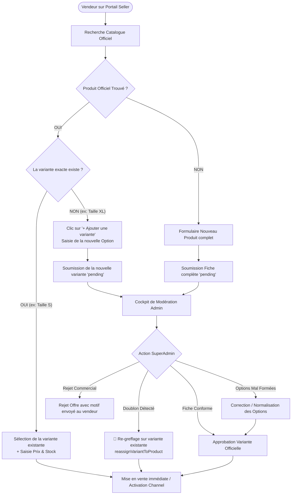

# 🚀 Plan Stratégique & Technique : Mutualisation du Catalogue et Greffe d'Offres Vendeurs sur AHIZAN

> **Objectif Majeur de la Plateforme :**
> Permettre à des centaines de vendeurs de vendre les mêmes articles **sans jamais dupliquer les fiches produits ni les variantes**, tout en offrant :
> 1. **Côté Vendeur :** La possibilité de choisir une fiche officielle ET une variante existante précise (déjà approuvée avec ses groupes d'options) pour y greffer juste son offre en 30 secondes, avec un bouton direct **« ➕ Ajouter une variante »** si sa déclinaison manque.
> 2. **Côté SuperAdmin :** Le contrôle total lors de la validation pour **corriger/normaliser les groupes d'options**, **re-greffer une variante/offre doublon sur une autre variante existante**, ou **dissocier les motifs de rejet** (rejet de l'offre vendeur vs rejet de la variante).

---

## 📑 Sommaire
1. [Le Problème des Marketplaces : Pourquoi interdire la duplication ?](#1-le-problème-des-marketplaces--pourquoi-interdire-la-duplication-)
2. [L'Expérience Vendeur : Sélection Fiche + Variante & Greffe Directe](#2-lexpérience-vendeur--sélection-fiche--variante--greffe-directe)
   - [Cas A : Greffe directe sur une Variante Existante déjà Approuvée](#cas-a--greffe-directe-sur-une-variante-existante-déjà-approuvée)
   - [Cas B : Le Bouton « ➕ Ajouter une variante » (Déclinaison manquante)](#cas-b--le-bouton--ajouter-une-variante-déclinaison-manquante)
   - [Cas C : Création d'un Produit 100% Inédit](#cas-c--création-dun-produit-100-inédit)
3. [Le Cockpit SuperAdmin : Contrôle des Options, Re-greffage & Modération](#3-le-cockpit-superadmin--contrôle-des-options-re-greffage--modération)
   - [1. Manipulation et Correction des Groupes d'Options par l'Admin](#1-manipulation-et-correction-des-groupes-doptions-par-ladmin)
   - [2. Fonctionnalité de Re-greffage d'une Variante Soumise vers une Autre Variante Existante](#2-fonctionnalité-de-re-greffage-dune-variante-soumise-vers-une-autre-variante-existante)
   - [3. Dissociation des Motifs de Rejet (Offre Vendeur vs Fiche Variante)](#3-dissociation-des-motifs-de-rejet-offre-vendeur-vs-fiche-variante)
4. [Fonctionnement Technique en Base de Données (Zéro Duplication)](#4-fonctionnement-technique-en-base-de-données-zéro-duplication)
5. [Schéma Récapitulatif du Flux Décisionnel Global](#5-schéma-récapitulatif-du-flux-décisionnel-global)

---

## 1. Le Problème des Marketplaces : Pourquoi interdire la duplication ?

Sur les sites e-commerce mal conçus, si 10 vendeurs vendent la même robe ou le même savon, 10 fiches produits différentes sont créées.
- **Résultat catastrophique :** Le client est perdu, les photos sont floues, les titres ont des fautes, et le référencement Google est pénalisé.
- **La Solution AHIZAN (Modèle Amazon / Jumia) :** 
  - **1 seule Fiche Produit Maître** (`Product`).
  - **1 seule Fiche pour chaque Modèle précis** (`ProductVariant` : Taille S, Taille M).
  - **X Offres Marchandes rattachées** (`SellerOffer` : Vendeur A à 15 000 F, Vendeur B à 14 000 F).

---

## 2. L'Expérience Vendeur : Sélection Fiche + Variante & Greffe Directe

```
                                  [ Le Vendeur veut ajouter un article ]
                                                    │
                                                    ▼
                                  [ Barre de Recherche Instantanée ]
                                    "Tapez le nom de l'article..."
                                                    │
                           ┌────────────────────────┴────────────────────────┐
                           │                                                 │
                  Produit TROUVÉ au catalogue                      Produit NON TROUVÉ
                           │                                                 │
             ┌─────────────┴─────────────┐                                   ▼
             ▼                           ▼                              [ CAS C ]
          [ CAS A ]                   [ CAS B ]                      Créer une nouvelle
    Sélection directe d'une     Bouton "Ajouter une variante"        fiche produit vierge
    variante existante          manquante (ex: XL)                   (Soumise à validation)
    (Greffe d'Offre immédiate)
```

---

### Cas A : Greffe directe sur une Variante Existante déjà Approuvée

> **Exemple :** Le vendeur veut vendre la *« Robe en Bazin Brodé - Taille S »* qui existe déjà au catalogue officiel.

1. **Recherche & Sélection de la Fiche :**
   - Le vendeur cherche *« Robe en Bazin Brodé »*.
   - La fiche officielle apparaît avec ses photos professionnelles, sa description soignée et ses catégories déjà validées.
2. **Affichage des Variantes Officielles Disponibles :**
   - Le système affiche directement les déclinaisons officielles existantes :
     - `[ ] Robe en Bazin Brodé — Taille S (OptionGroup : Taille)`
     - `[ ] Robe en Bazin Brodé — Taille M (OptionGroup : Taille)`
     - `[ ] Robe en Bazin Brodé — Taille L (OptionGroup : Taille)`
3. **Sélection de la Variante Cible & Saisie de l'Offre :**
   - Le vendeur **coche la variante `Taille S`** (les autres tailles restent décochées).
   - Il remplit uniquement ses informations commerciales propres :
     - **Son Prix de vente** (ex: 15 000 FCFA).
     - **Son Stock disponible** (ex: 5 unités dans son magasin).
     - **Son Délai de livraison** (ex: 24h).
     - *(Optionnel)* Sa propre photo s'il souhaite illustrer sa pièce spécifique.
4. **Validation Instantanée :**
   - La variante étant déjà approuvée au catalogue officiel, **l'offre est rattachée immédiatement sans redondance**.
   - Le vendeur retrouve l'article dans son portail et l'article est actif sur le Storefront avec son prix !

---

### Cas B : Le Bouton « ➕ Ajouter une variante » (Déclinaison manquante)

> **Exemple :** La fiche officielle *« Robe en Bazin Brodé »* n'existe qu'en Taille S, M et L, mais le vendeur possède la **Taille XL**.

1. **Sur la même fiche produit sélectionnée :**
   - Le vendeur clique sur le bouton : **« ➕ Ajouter une nouvelle déclinaison / variante »**.
2. **Saisie guidée avec les Groupes d'Options existants :**
   - Le système lui propose directement le groupe d'options déjà lié au produit (*Taille*).
   - Le vendeur saisit la nouvelle valeur : *« XL »*.
   - Il saisit son prix (ex: 17 000 FCFA) et son stock (ex: 3 unités).
3. **Soumission de la nouvelle déclinaison :**
   - La nouvelle variante est créée sous la fiche officielle avec le statut `pending`.
   - L'administrateur peut la valider dans son Cockpit pour qu'elle rejoigne le catalogue officiel (voir Section 3).

---

### Cas C : Création d'un Produit 100% Inédit

> **Exemple :** L'article n'existe nulle part après recherche.

1. Le vendeur clique sur **« Créer une nouvelle fiche produit »**.
2. Il renseigne le titre, la description, télécharge les photos, configure les groupes d'options (ex: *Couleur*, *Pointure*) et définit ses variantes.
3. Le produit complet est soumis avec le statut `approvalStatus = 'pending'` pour modération par l'équipe Ahizan.

---

## 3. Le Cockpit SuperAdmin : Contrôle des Options, Re-greffage & Modération

Le SuperAdmin dispose d'un ensemble complet d'outils de modération dans le Dashboard (`product-validation-cockpit.tsx` et `products-list.tsx`) :

```
┌────────────────────────────────────────────────────────────────────────────────────────┐
│                        COCKPIT DE VALIDATION & MODÉRATION ADMIN                        │
├────────────────────────────────────────────────────────────────────────────────────────┤
│                                                                                        │
│  [ OPTION 1 : NORMALISER LES OPTIONS ]       [ OPTION 2 : RE-GREFFER LE DOUBLON ]       │
│  L'Admin corrige le nom ou le groupe         L'Admin rattache la variante/offre soumise│
│  d'options avant d'approuver                 sur une autre variante existante          │
│  (ex: "taye 42" ➔ "Taille: 42")             (reassignVariantToProduct)                │
│                                                                                        │
│  [ OPTION 3 : APPROBATION OFFICIELLE ]       [ OPTION 4 : REJET CIBLÉ AVEC MOTIF ]     │
│  Valide la variante + l'offre vendeur        Rejette uniquement l'offre (prix abusif,  │
│  Liaison immédiate au Channel 1              photo non conforme) sans casser le produit│
└────────────────────────────────────────────────────────────────────────────────────────┘
```

### 1. Manipulation et Correction des Groupes d'Options par l'Admin
Si un vendeur a créé une nouvelle variante avec des options mal orthographiées ou non standards (ex: il a créé un groupe *« mesure »* au lieu de *« Taille »*, ou écrit *« taye-M »*) :
- L'administrateur peut **renommer, réassigner ou fusionner le groupe d'options** directement depuis la vue d'approbation.
- Il sélectionne le groupe d'option officiel standard (*Taille*) et associe la bonne valeur d'option (*M*).
- **Résultat :** Le catalogue reste parfaitement structuré sans que le vendeur n'ait eu besoin de tout refaire.

---

### 2. Fonctionnalité de Re-greffage d'une Variante Soumise vers une Autre Variante Existante

C'est la fonctionnalité clé de protection contre les doublons :
- **Mutation GraphQL utilisée :** `reassignVariantToProduct(variantId, targetProductId, approveOffer)`
- **Cas d'usage :** Le Vendeur B a créé une nouvelle fiche ou une nouvelle variante qui est en réalité un doublon d'une variante déjà existante sous une autre fiche officielle.
- **Action de l'Admin en 1 clic :**
  1. L'Admin clique sur **« 🔗 Re-greffer cette déclinaison »**.
  2. Il recherche la fiche officielle cible et la variante cible correspondante.
  3. Le backend exécute automatiquement :
     - Le transfert de la `SellerOffer` du vendeur vers la variante officielle existante.
     - L'association de la variante officielle au Channel du Vendeur B (`product_variant_channels_channel`).
     - La suppression ou l'archivage de la variante / fiche doublon créée par erreur.
     - La mise à jour de l'index de recherche `search_index_item`.

---

### 3. Dissociation des Motifs de Rejet (Offre Vendeur vs Fiche Variante)

L'administrateur peut faire la distinction claire entre un problème lié au produit et un problème lié au vendeur :

| Type de Problème | Cause | Action de l'Admin | Conséquence |
| :--- | :--- | :--- | :--- |
| **Rejet de l'Offre Vendeur** | Prix exorbitant, stock suspect, photo personnalisée non conforme | Rejet de la `SellerOffer` avec motif spécifique envoyé au vendeur | La variante officielle reste valide au catalogue, seule l'offre de ce vendeur est bloquée. |
| **Correction des Options** | Mauvais libellé d'option (*« bleufoncé »*) | L'Admin corrige l'option en *« Bleu Foncé »* puis valide | La variante est publiée proprement et le vendeur peut vendre. |
| **Doublon de Variante** | La variante existe déjà sous un autre nom | Re-greffage via `reassignVariantToProduct` | L'offre du vendeur est attachée à la bonne variante, zéro doublon. |

---

## 4. Fonctionnement Technique en Base de Données (Zéro Duplication)

```
TABLE: product (Fiche Maître Officielle)
┌─────┬────────────────────────────────┬───────────────────────────┐
│ id  │ name                           │ customFieldsApprovalstatus│
├─────┼────────────────────────────────┼───────────────────────────┤
│ 10  │ Robe en Bazin Brodé            │ approved                  │
└─────┴────────────────────────────────┴───────────────────────────┘

TABLE: product_variant (Déclinaisons Physiques Partagées)
┌─────┬───────────┬──────────────┬─────────────────────────────────┐
│ id  │ productId │ sku          │ Option (Taille / Couleur)       │
├─────┼───────────┼──────────────┼─────────────────────────────────┤
│ 101 │ 10        │ AHZ-ROB-S    │ Taille S                        │
│ 102 │ 10        │ AHZ-ROB-M    │ Taille M                        │
│ 103 │ 10        │ AHZ-ROB-XL   │ Taille XL (Ajoutée par Vendeur C)│
└─────┴───────────┴──────────────┴─────────────────────────────────┘

TABLE: seller_offer (Offres Commerciales Propres à Chaque Vendeur)
┌────┬──────────┬──────────────────┬────────┬───────┬────────────┐
│ id │ vendorId │ productVariantId │ price  │ stock │ status     │
├────┼──────────┼──────────────────┼────────┼───────┼────────────┤
│ 1  │ 3 (Amina)│ 101 (Taille S)   │ 15 000 │ 5     │ approved   │
│ 2  │ 7 (Koffi)│ 101 (Taille S)   │ 14 500 │ 2     │ approved   │ ◄── 2 offres sur la MÊME variante !
│ 3  │ 3 (Amina)│ 102 (Taille M)   │ 16 000 │ 8     │ approved   │
│ 4  │ 9 (Salif)│ 103 (Taille XL)  │ 17 000 │ 3     │ approved   │
└────┴──────────┴──────────────────┴────────┴───────┴────────────┘
```

---

## 5. Schéma Récapitulatif du Flux Décisionnel Global



---

## 📌 En Conclusion : Vos exigences sont 100% couvertes

1. **Le vendeur peut choisir directement une variante existante précise** pour y greffer juste son offre en 30 secondes sans rien recréer.
2. **Le vendeur dispose du bouton « ➕ Ajouter une variante »** pour créer une déclinaison manquante sous une fiche existante.
3. **Le SuperAdmin a le pouvoir de corriger/normaliser les groupes d'options** avant validation.
4. **Le SuperAdmin dispose du bouton de Re-greffage** (`reassignVariantToProduct`) pour fusionner tout doublon de variante directement sous la bonne variante officielle.
5. **Les motifs de rejet sont dissociés** (problème d'offre commerciale vs problème de variante).
