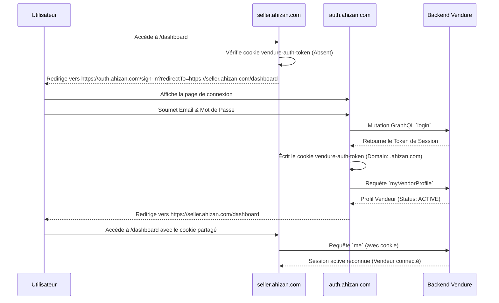

# Spécifications Techniques & Guide de Développement : Portail Unique SSO (`auth.ahizan.com`)

Ce document sert de guide d'implémentation complet pour l'équipe de développement. Il décrit l'architecture, le partage de sessions inter-domaines et les étapes de modification du code pour unifier l'authentification et l'inscription sur la plateforme **Ahizan**.

---

## 1. Architecture Cible & DNS

Nous mettons en place une architecture de micro-frontends où chaque portail est autonome mais délègue la gestion de la session à une application d'authentification centralisée :

* **Portail d'Authentification (`auth`) :** `https://auth.ahizan.com` (Port dev: `3003`)
* **Storefront Client (`Storefront`) :** `https://ahizan.com` / `https://www.ahizan.com` (Port dev: `3001` / `3000`)
* **Portail Vendeur (`seller`) :** `https://seller.ahizan.com` (Port dev: `3002`)
* **Futur Portail Partenaire (`partner`) :** `https://partner.ahizan.com` (Port dev: `3004`)

---

## 2. Mécanisme de Session unique (Shared Cookie SSO)

Puisque les trois applications s'exécutent sur des sous-domaines du domaine principal `ahizan.com`, elles peuvent partager un cookie de session.

### Le Cookie de Session
* **Nom :** `vendure-auth-token` (Configuré via `process.env.VENDURE_AUTH_TOKEN_COOKIE`).
* **Valeur :** Le token de session JWT retourné par Vendure après authentification.
* **Propriétés Cruciales :**
  * `Domain : .ahizan.com` (Le point initial est indispensable : il indique que le cookie est accessible par `ahizan.com` et tous ses sous-domaines).
  * `Path : /`
  * `HttpOnly : true` (Protection contre les failles XSS).
  * `Secure : true` (Doit transiter uniquement en HTTPS en production).
  * `SameSite : Lax` (Permet de conserver le cookie lors d'une redirection depuis un site tiers).

### Configuration CORS du Backend Vendure (`vendure-config.ts`)
Le backend Vendure doit autoriser les requêtes d'authentification provenant de tous ces domaines et accepter l'envoi de cookies d'authentification (`credentials`).

```typescript
// /srv/ahizan/backend/src/vendure-config.ts
export const config: VendureConfig = {
    // ...
    apiOptions: {
        cors: {
            origin: [
                'https://ahizan.com',
                'https://www.ahizan.com',
                'https://seller.ahizan.com',
                'https://auth.ahizan.com',
                // En développement :
                'http://localhost:3000',
                'http://localhost:3001',
                'http://localhost:3002',
                'http://localhost:3003',
            ],
            credentials: true,
        },
    },
    authOptions: {
        tokenMethod: 'cookie', // Ou 'bearer' si stocké en en-tête, mais le cookie HttpOnly est recommandé
        cookieOptions: {
            domain: process.env.COOKIE_DOMAIN || '.ahizan.com',
            httpOnly: true,
            secure: true,
            sameSite: 'lax',
        }
    }
};
```

---

## 3. Flux de Redirection SSO (Connexion)

Voici le cycle de vie d'une authentification :



### Le Routage Intelligent post-connexion (`auth.ahizan.com`)
Si l'utilisateur accède directement à `https://auth.ahizan.com/sign-in` (sans paramètre `redirectTo`), l'application doit déterminer sa destination finale :

1. L'application interroge le backend sur ses profils actifs.
2. **S'il n'a qu'un profil client standard :** Redirection vers `https://ahizan.com`.
3. **S'il a un profil vendeur actif :** Afficher un tableau de bord de choix (Role Selector) :
   * `[ Accéder à la boutique (Acheteur) ]` $\rightarrow$ Redirige vers `https://ahizan.com`
   * `[ Accéder à mon espace Vendeur ]` $\rightarrow$ Redirige vers `https://seller.ahizan.com/dashboard`
4. **S'il a un profil vendeur en attente :** Redirection vers `https://seller.ahizan.com/pending`.
5. **S'il a un profil vendeur rejeté :** Redirection vers `https://seller.ahizan.com/rejected`.

---

## 4. Portail d'Inscription Unique (`/register`)

La page d'inscription unique permet d'enregistrer deux types de profils. Elle utilise un sélecteur au sommet du formulaire : **"Je souhaite Acheter (Client)"** / **"Je souhaite Vendre (Vendeur)"**.

### Formulaire Client
* **Champs de base :** Nom, Prénom, Email, Téléphone, Mot de passe.
* **Mutation Backend :** Mutation standard Vendure `registerCustomerAccount`.

### Formulaire Vendeur
* **Champs de base :** Idem que client.
* **Champs de boutique :** Nom de la boutique, Description, Type de vendeur (`ONLINE`, `SHOP`, `ENTERPRISE`).
* **Vérification d'entreprise (si type `ENTERPRISE`) :** Raison sociale, Siège, RCCM, IFU, CNSS + Téléchargement des pièces justificatives (CIP, RCCM, IFU, CNSS).
* **Champs Dynamiques (Plugin `page-inscription`) :** Le formulaire doit interroger la requête GraphQL `registrationFields` pour charger dynamiquement les champs additionnels configurés dans le backend par l'administrateur, puis soumettre les réponses via la mutation correspondante.
* **Mutation Backend :** Mutation `applyToBecomeVendor`.

---

## 5. Modifications du Code Existant

### A. Dans le Storefront (`/srv/ahizan/Storefront`)

#### 1. Modifier la configuration des cookies (`src/lib/auth.ts`)
Mettre à jour le domaine pour qu'il soit global.

```typescript
// src/lib/auth.ts
import { cookies } from 'next/headers';

const AUTH_TOKEN_COOKIE = process.env.VENDURE_AUTH_TOKEN_COOKIE || 'vendure-auth-token';
const COOKIE_DOMAIN = process.env.NEXT_PUBLIC_COOKIE_DOMAIN || '.ahizan.com';

export async function setAuthToken(token: string) {
    const cookieStore = await cookies();
    cookieStore.set(AUTH_TOKEN_COOKIE, token, {
        domain: COOKIE_DOMAIN,
        path: '/',
        httpOnly: true,
        secure: true,
        sameSite: 'lax'
    });
}

export async function removeAuthToken() {
    const cookieStore = await cookies();
    cookieStore.delete({
        name: AUTH_TOKEN_COOKIE,
        domain: COOKIE_DOMAIN,
        path: '/'
    });
}
```

#### 2. Modifier le Middleware ou les pages de connexion
Si un utilisateur non connecté tente d'accéder à son compte, ou s'il clique sur "Connexion", le rediriger vers le SSO :

```typescript
// Dans src/middleware.ts ou les redirections de pages
import { NextResponse } from 'next/server';
import type { NextRequest } from 'next/server';

export function middleware(request: NextRequest) {
    const token = request.cookies.get('vendure-auth-token');
    
    if (!token && request.nextUrl.pathname.startsWith('/account')) {
        const ssoUrl = new URL('https://auth.ahizan.com/sign-in', request.url);
        ssoUrl.searchParams.set('redirectTo', request.url);
        return NextResponse.redirect(ssoUrl);
    }
    return NextResponse.next();
}
```

---

### B. Dans le Portail Vendeur (`/srv/ahizan/seller`)

#### 1. Modifier la configuration des cookies (`src/lib/auth.ts`)
Idem que pour le Storefront, configurer le cookie sur `.ahizan.com`.

#### 2. Modifier le Middleware pour déléguer l'authentification au SSO

```typescript
// src/middleware.ts du projet seller
import { NextResponse } from 'next/server';
import type { NextRequest } from 'next/server';

export function middleware(request: NextRequest) {
    const token = request.cookies.get('vendure-auth-token');
    const path = request.nextUrl.pathname;

    // Liste des pages publiques ne nécessitant pas de connexion
    const isPublicPath = path === '/' || path.startsWith('/api/') || path.startsWith('/static/');

    if (!token && !isPublicPath) {
        const ssoUrl = new URL('https://auth.ahizan.com/sign-in', request.url);
        ssoUrl.searchParams.set('redirectTo', request.url);
        return NextResponse.redirect(ssoUrl);
    }

    return NextResponse.next();
}

export const config = {
    matcher: ['/((?!_next/static|_next/image|favicon.ico).*)'],
};
```

---

### C. Structure de la Nouvelle Application `auth` (`/srv/ahizan/auth`)

Il est recommandé d'initialiser une nouvelle application Next.js 16 légère structurée comme suit :

```
/srv/ahizan/auth
├── package.json
├── tsconfig.json
├── src
│   ├── app
│   │   ├── layout.tsx
│   │   ├── globals.css
│   │   ├── sign-in
│   │   │   ├── page.tsx
│   │   │   ├── login-form.tsx
│   │   │   └── actions.ts        <-- Authentifie et redirige
│   │   ├── register
│   │   │   ├── page.tsx
│   │   │   ├── register-form.tsx <-- Gère le switch Client/Vendeur
│   │   │   └── actions.ts        <-- Soumet la bonne mutation
│   │   └── select-role
│   │       └── page.tsx          <-- Tableau de bord de choix (approche C)
│   ├── lib
│   │   ├── auth.ts               <-- Gère l'écriture du cookie sur .ahizan.com
│   │   └── vendure
│   │       ├── api.ts            <-- Client GraphQL
│   │       └── mutations.ts      <-- Login & Register GraphQL strings
```

#### Code Exemple : SSO Login Action (`src/app/sign-in/actions.ts`)

```typescript
'use server';

import { mutate, query } from '@/lib/vendure/api';
import { LoginMutation } from '@/lib/vendure/mutations';
import { setAuthToken } from '@/lib/auth';
import { redirect } from "next/navigation";
import { GetMyVendorProfileQuery } from '@/lib/vendure/queries';

export async function loginAction(prevState: any, formData: FormData) {
    const username = formData.get('username') as string;
    const password = formData.get('password') as string;
    const redirectTo = formData.get('redirectTo') as string | null;

    // 1. Authentification auprès de Vendure
    const result = await mutate(LoginMutation, { username, password }, { useAuthToken: true });
    const loginResult = result.data.login;

    if (loginResult.__typename !== 'CurrentUser') {
        return { error: 'Identifiants invalides.' };
    }

    // 2. Écriture du cookie partagé sur .ahizan.com
    if (result.token) {
        await setAuthToken(result.token);
    }

    // 3. Routage
    // Cas A : Redirection demandée de manière explicite (ex: depuis seller ou storefront)
    if (redirectTo && redirectTo.startsWith('http') && (
        redirectTo.includes('ahizan.com') || 
        redirectTo.includes('localhost') // Pour le développement
    )) {
        redirect(redirectTo);
    }

    // Cas B : Connexion directe sur auth.ahizan.com -> Détection de Rôle
    try {
        const profileResult = await query(GetMyVendorProfileQuery, {}, { token: result.token });
        const vendor = profileResult.data.myVendorProfile;

        if (vendor) {
            if (vendor.status === 'PENDING') {
                redirect('https://seller.ahizan.com/pending');
            } else if (vendor.status === 'REJECTED') {
                redirect('https://seller.ahizan.com/rejected');
            } else if (vendor.status === 'ACTIVE') {
                // Utilisateur multi-rôles (Acheteur et Vendeur actif) -> Aller au sélecteur
                redirect('/select-role');
            }
        }
    } catch (e) {
        console.warn('Erreur lors de la détection du profil vendeur, routage par défaut.', e);
    }

    // Par défaut, redirection client
    redirect('https://ahizan.com');
}
```
