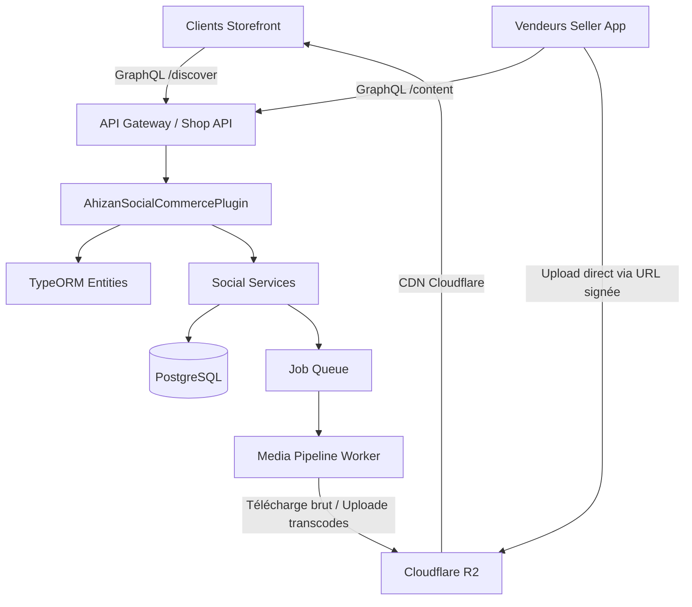
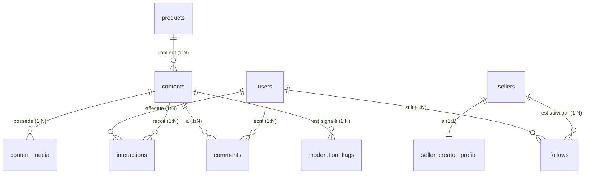
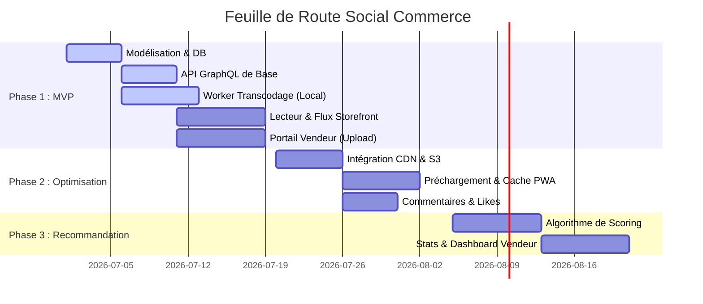

# Architecture & Engineering Blueprint: Ahizan Social Commerce

Ce document sert de référence technique officielle et de feuille de route pour l'implémentation de la fonctionnalité **Social Commerce** (nom de code interne : **« Découvrir »**) sur la marketplace Ahizan. Il traduit les exigences fonctionnelles du PRD en choix d'architecture, schémas de données, spécifications d'API et guides d'implémentation, en parfaite adéquation avec la base de code existante.

---

## 1. Analyse de l'Existant

La base de code d'Ahizan est saine, moderne et structurée autour d'un écosystème découplé :

### 1.1 Architecture Actuelle
*   **Back-end** : Construit sur **Vendure v3.6.4** (NestJS, Fastify, TypeORM, GraphQL). L'application est modulaire, utilisant des plugins personnalisés pour étendre le comportement de base (ex: `MultivendorPlugin`, `AhizanNotificationsPlugin`).
*   **Front-ends** : Trois applications **Next.js 16 (App Router)** avec **React 19** et **TailwindCSS** :
    *   `Storefront` (port 3001) : Interface acheteur. Elle utilise `gql.tada` pour des requêtes GraphQL typées et `serwist` pour le support PWA (Service Workers).
    *   `seller` (port 3002) : Portail vendeur pour la gestion du catalogue et des commandes.
    *   `auth` : Portail d'authentification unifiée.
*   **Base de Données** : **PostgreSQL** en production (avec SQLite pour le développement local).

### 1.2 Forces de l'Existant
*   **Extensibilité de Vendure** : Le système de plugins, d'entités personnalisées et d'extensions de schéma GraphQL (`adminApiExtensions`, `shopApiExtensions`) permet d'ajouter le Social Commerce de manière 100% additive sans modifier le cœur de la marketplace.
*   **EventBus de Vendure** : Permet un découplage total pour les tâches asynchrones (ex: déclencher une notification lors de la publication d'une vidéo, mettre à jour des statistiques).
*   **Type-safety (GraphQL + gql.tada)** : Garantit une intégration robuste et sans régression entre le backend et les frontends.
*   **PWA Prête** : L'intégration existante de `serwist` sur le Storefront facilite l'implémentation du cache local pour les vidéos.

### 1.3 Faiblesses et Limitations Actuelles
*   **Absence de Pipeline Média** : Le backend utilise un stockage local simple (`WatermarkedLocalAssetStorageStrategy`). Il n'y a aucun service de transcodage vidéo (FFmpeg) ou de gestion de streaming adaptatif.
*   **Modèle de Données d'Interactions** : La table `interactions` va générer un volume d'écritures très élevé (likes, vues, temps de visionnage). Sans partitionnement ou base de données de séries temporelles, cela pourrait dégrader les performances de PostgreSQL.

### 1.4 Dépendances Clés à Introduire
1.  **Cloudflare R2** : Pour le stockage des vidéos brutes et transcodées. R2 offre des frais de transfert sortant (egress) à 0 $, ce qui est indispensable pour un flux de type "TikTok" à fort trafic.
2.  **Cloudflare CDN** : Positionné devant le bucket R2 pour mettre en cache les vidéos et les servir depuis les serveurs Edge les plus proches des utilisateurs ouest-africains.
3.  **FFmpeg / fluent-ffmpeg** : Pour le transcodage des vidéos sur un worker dédié.
4.  **BullMQ** (ou utilisation du `JobQueueService` de Vendure) : Pour gérer la file d'attente du transcodage en arrière-plan.
5.  **Hls.js / Video.js** : Côté Storefront pour lire les flux vidéo de manière fluide avec détection de bande passante (à partir de la Phase 2).

### 1.5 Risques Techniques et Atténuations
*   **Risque 1 : Surcharge CPU et bande passante du serveur lors de la gestion des vidéos**
    *   *Atténuation* : **Séparation stricte des tâches**. Le serveur principal ne touche jamais aux fichiers vidéo. L'application vendeur uploade les fichiers bruts directement sur **Cloudflare R2** via des **URLs signées (presigned PUT URLs)**. Le transcodage est délégué à un worker séparé (`index-worker.ts`) s'exécutant sur une instance dédiée.
*   **Risque 2 : Coûts de bande passante astronomiques (diffusion vidéo en boucle)**
    *   *Atténuation* : Utilisation exclusive de **Cloudflare R2** (bande passante sortante à 0 $). Caching agressif sur le CDN de Cloudflare pour éviter de requêter R2 pour les vidéos populaires/virales.
*   **Risque 3 : Latence de chargement vidéo en Afrique de l'Ouest (connexions 3G instables)**
    *   *Atténuation* : Compression agressive (profil *low* à 360p), miniatures WebP ultra-légères (< 30 Ko), préchargement intelligent limité à une seule vidéo (N+1) et cache local via le Service Worker du Storefront.

---

## 2. Impact sur le Projet

Le développement de cette fonctionnalité respecte le principe d'**extension sans refonte**.



### 2.1 Back-end (Vendure Plugin)
*   **Conservé** : La gestion des produits, variantes, commandes, paiements et expéditions.
*   **Adapté** : Le plugin `MultivendorPlugin` sera adapté pour lier le concept de `Vendor` à un `SellerCreatorProfile`.
*   **Étendu** :
    *   La table `product` (via les custom fields de Vendure) pour stocker `content_count` (le nombre de contenus associés).
    *   La table `order_line` (ou `order_item` selon la version) pour inclure `sourceContentId` afin de suivre l'attribution des ventes.
*   **Créé** : Un nouveau plugin `AhizanSocialCommercePlugin` qui encapsule :
    *   Les entités : `Content`, `ContentMedia`, `Interaction`, `Comment`, `Follow`, `ContentStatsDaily`, `ModerationFlag`.
    *   Les services : `ContentService` (générant les URLs de dépôt signées pour R2), `InteractionService`, `FeedService`, `ModerationService`, `StatsService`.
    *   Les résolveurs GraphQL pour les API Shop et Admin.

### 2.2 Front-end Storefront
*   **Conservé** : Les pages de recherche, fiches produits standards, panier et checkout.
*   **Adapté** : La page d'accueil pour inclure une section "Découvrir" (aperçus vidéo/photo sous forme de grille).
*   **Étendu** : La barre de navigation basse (sur mobile) pour ajouter l'onglet principal "Découvrir".
*   **Créé** :
    *   La page `/discover` contenant le flux vertical infini de vidéos et de carrousels.
    *   Le composant `VideoPlayer` optimisé (gestion du son global, play/pause sur visibilité, téléchargement depuis le CDN Cloudflare).
    *   Le composant `PurchaseDrawer` (tiroir d'achat rapide sans quitter le flux).
    *   Le composant `CommentsDrawer` pour lire et écrire des commentaires sous forme de modal/tiroir.

### 2.3 Front-end Seller
*   **Conservé** : L'interface de création de produits et de suivi des commandes.
*   **Adapté** : Le menu latéral pour ajouter les sections "Mon Profil Créateur", "Mes Contenus" et "Statistiques".
*   **Créé** :
    *   L'écran de configuration du profil créateur (bio, photo de couverture).
    *   L'écran de publication de contenu (requête d'URL signée, upload direct du fichier de la galerie vers Cloudflare R2, sélection obligatoire d'un produit, légende et hashtags).
    *   Le tableau de bord analytique (courbes de vues, taux de clic, taux de conversion, revenus générés).

---

## 3. Architecture Cible & Flux de Données

### 3.1 Flux de Publication de Contenu (Vendeur)
1.  Le vendeur sélectionne une vidéo et un produit dans l'application `seller`.
2.  L'application appelle la mutation `requestContentUpload` et obtient une **URL d'upload signée directement pour Cloudflare R2** et un `mediaId`.
3.  L'application `seller` uploade le fichier vidéo brut directement sur le bucket Cloudflare R2 via une requête HTTP PUT, **sans surcharger le serveur de la marketplace**.
4.  Une fois l'upload terminé, l'application appelle la mutation `registerUploadedMedia(mediaId: "...")`. Le statut passe à `processing`.
5.  Un job de transcodage est envoyé dans la file d'attente.
6.  Le worker dédié télécharge la vidéo brute depuis R2, la transcode en 3 résolutions (360p, 480p, 720p) via FFmpeg, génère les miniatures WebP, uploade les fichiers finaux sur R2, supprime la vidéo brute de R2 pour économiser l'espace, et met à jour la base de données.
7.  Le contenu passe au statut `pending_review` (ou directement `published` si la modération automatique par mots-clés est validée).

### 3.2 Flux de Lecture et Interaction (Acheteur)
1.  Le Storefront appelle la requête GraphQL `discoverFeed(options: { limit: 5, cursor: "..." })`.
2.  Le `FeedService` interroge le cache Redis pour récupérer les IDs de contenus, ou exécute une requête SQL optimisée.
3.  Le Storefront affiche les vidéos en chargeant les flux directement depuis le **CDN Cloudflare** (qui met en cache les fichiers de R2).
4.  Lorsque l'utilisateur regarde une vidéo pendant plus de 2 secondes, le Storefront appelle la mutation `registerInteraction(input: { contentId: "...", type: VIEW, watchSeconds: 5 })`.
5.  L'interaction est enregistrée dans la table `interactions` (qui est partitionnée).
6.  Un événement `InteractionEvent` est publié sur l'EventBus de Vendure.
7.  Le `StatsService` écoute cet événement et met à jour de manière asynchrone le compteur global sur l'entité `Content` et incrémente les statistiques journalières dans `ContentStatsDaily`.

---

## 4. Modifications de la Base de Données

Toutes les nouvelles tables sont créées via des entités TypeORM classiques au sein du plugin.



### 4.1 Spécification des Nouvelles Entités (TypeORM)

#### Entité `Content` (Table : `contents`)
Représente le post de contenu (vidéo, photo ou carrousel) associé à un produit.
```typescript
@Entity()
export class Content extends VendureEntity {
    @Index()
    @ManyToOne(type => Seller)
    seller: Seller;

    @Index()
    @ManyToOne(type => Product)
    product: Product;

    @Column({ type: 'varchar' })
    type: 'video' | 'photo' | 'carousel';

    @Column({ type: 'varchar', nullable: true })
    subtype: 'demo' | 'before_after' | 'testimonial' | 'unboxing' | 'promo' | 'standard';

    @Index()
    @Column({ type: 'varchar', default: 'draft' })
    status: 'draft' | 'processing' | 'pending_review' | 'published' | 'auto_hidden' | 'unpublished' | 'deleted';

    @Column({ type: 'text', nullable: true })
    caption: string;

    @Column('simple-array', { nullable: true })
    hashtags: string[];

    @Column({ type: 'text', nullable: true })
    thumbnailUrl: string;

    @Column({ type: 'text', nullable: true })
    mediaMasterUrl: string; // Référence de la vidéo brute sur R2 (supprimée après transcodage)

    @Column({ type: 'int', nullable: true })
    durationSeconds: number;

    @Column({ type: 'bigint', default: 0 })
    viewCount: number;

    @Column({ type: 'bigint', default: 0 })
    likeCount: number;

    @Column({ type: 'timestamp', nullable: true })
    publishedAt: Date;
}
```

#### Entité `ContentMedia` (Table : `content_media`)
Gère les différents fichiers associés à un contenu (résolutions vidéo multiples stockées sur R2, images d'un carrousel).
```typescript
@Entity()
export class ContentMedia extends VendureEntity {
    @Index()
    @ManyToOne(type => Content, { onDelete: 'CASCADE' })
    content: Content;

    @Column({ type: 'smallint', default: 0 })
    position: number;

    @ManyToOne(type => ProductVariant, { nullable: true })
    variant: ProductVariant;

    @Column({ type: 'varchar' })
    resolution: 'low' | 'medium' | 'high' | 'original';

    @Column({ type: 'text' })
    url: string; // URL pointant vers le CDN Cloudflare (devant R2)

    @Column({ type: 'varchar' })
    format: 'mp4_h264' | 'webp' | 'jpeg';

    @Column({ type: 'int', nullable: true })
    sizeBytes: number;
}
```

#### Entité `Interaction` (Table : `interactions`)
*Important : Cette table à fort volume doit utiliser une clé primaire de type `BIGINT` auto-incrémentée et être partitionnée par mois sur le champ `createdAt` en PostgreSQL de production.*
```typescript
@Entity()
export class Interaction {
    @PrimaryGeneratedColumn({ type: 'bigint' })
    id: string;

    @Index()
    @Column({ type: 'uuid' })
    userId: string;

    @Index()
    @Column({ type: 'uuid' })
    contentId: string;

    @Column({ type: 'varchar' })
    type: 'view' | 'like' | 'unlike' | 'share' | 'favorite' | 'add_to_cart' | 'follow_from_content' | 'comment';

    @Column({ type: 'smallint', nullable: true })
    watchSeconds: number;

    @Column({ type: 'boolean', nullable: true })
    completed: boolean;

    @CreateDateColumn()
    createdAt: Date;
}
```

#### Entités Secondaires
*   **`SellerCreatorProfile`** : Table liée 1:1 à `Seller`. Contient `bio` (text), `coverPhotoUrl` (text) et `followerCount` (int, dénormalisé).
*   **`Follow`** : Table de liaison entre `User` (userId) et `Seller` (sellerId). Index unique composite sur `(userId, sellerId)`.
*   **`Comment`** : Table contenant `id`, `contentId`, `userId`, `parentId` (pour les réponses imbriquées), `body` (text) et `status` ('pending_review' | 'approved' | 'hidden').
*   **`ContentStatsDaily`** : Table d'agrégation contenant `contentId`, `date` (DATE), `views`, `likes`, `shares`, `cartAdds`, `ordersCount`, `revenue` (en centimes). Index composite unique sur `(contentId, date)`.
*   **`ModerationFlag`** : Table pour les signalements utilisateurs. Contient `contentId`, `reporterId`, `reason` (text), `status` ('pending' | 'reviewed' | 'dismissed') et `decision` (text).

### 4.2 Indexation et Optimisations DB
1.  **Index Composites** :
    *   `idx_contents_feed` : sur `(status, publishedAt DESC)` -> Essentiel pour récupérer rapidement les derniers contenus publiés.
    *   `idx_interactions_analytics` : sur `(contentId, type, createdAt)` -> Optimise le calcul des statistiques quotidiennes.
2.  **Partitionnement de la Table `interactions`** :
    En production, la table sera créée avec la clause `PARTITION BY RANGE (createdAt)`. Un script de migration annuel ou une tâche planifiée créera automatiquement les partitions mensuelles (ex: `interactions_y2026m07`).

---

## 5. Spécifications de l'API (GraphQL)

Conformément à la convention du projet, l'ensemble des interactions avec le client et le vendeur se fait par GraphQL. Les fichiers de médias volumineux sont uploadés via un endpoint de type REST avec autorisation.

### 5.1 Schéma GraphQL pour le Shop (Acheteurs)

```graphql
# Types de base
type CreatorProfile {
  id: ID!
  bio: String
  coverPhotoUrl: String
  followerCount: Int!
  isFollowing: Boolean!
}

type ContentMedia {
  id: ID!
  position: Int!
  resolution: String!
  url: String!
  format: String!
  sizeBytes: Int
}

type SocialContent {
  id: ID!
  type: String!
  subtype: String
  caption: String
  hashtags: [String!]!
  thumbnailUrl: String
  durationSeconds: Int
  viewCount: Int!
  likeCount: Int!
  publishedAt: DateTime
  seller: CreatorProfile!
  product: Product!
  media: [ContentMedia!]!
  isLiked: Boolean!
  isFavorited: Boolean!
}

type DiscoverFeedConnection {
  items: [SocialContent!]!
  nextCursor: String
}

type SocialComment {
  id: ID!
  body: String!
  user: User!
  replies: [SocialComment!]!
  createdAt: DateTime!
}

# Requêtes (Queries)
extend type Query {
  discoverFeed(limit: Int!, cursor: String): DiscoverFeedConnection!
  contentDetails(id: ID!): SocialContent
  contentComments(contentId: ID!, limit: Int!, cursor: String): [SocialComment!]!
  sellerCreatorProfile(sellerId: ID!): CreatorProfile
  sellerContents(sellerId: ID!, limit: Int!, cursor: String): [SocialContent!]!
}

# Mutations
extend type Mutation {
  registerInteraction(contentId: ID!, type: String!, watchSeconds: Int, completed: Boolean): Boolean!
  createComment(contentId: ID!, body: String!, parentId: ID): SocialComment!
  toggleLike(contentId: ID!): Boolean!
  followSeller(sellerId: ID!): Boolean!
  unfollowSeller(sellerId: ID!): Boolean!
  reportContent(contentId: ID!, reason: String!): Boolean!
}
```

### 5.2 Schéma GraphQL pour l'Administration (Vendeurs & Modérateurs)

```graphql
input CreateContentInput {
  productId: ID!
  type: String!
  subtype: String
  caption: String
  hashtags: [String!]
}

input UpdateContentInput {
  caption: String
  hashtags: [String!]
  productId: ID
}

type ContentUploadSignature {
  uploadUrl: String!
  mediaId: ID!
}

extend type Mutation {
  # Vendeur
  requestContentUpload(input: CreateContentInput!): ContentUploadSignature!
  registerUploadedMedia(mediaId: ID!): SocialContent!
  updateContent(id: ID!, input: UpdateContentInput!): SocialContent!
  publishContent(id: ID!): SocialContent!
  unpublishContent(id: ID!): SocialContent!
  deleteContent(id: ID!): Boolean!
  updateCreatorProfile(bio: String, coverPhotoUrl: String): CreatorProfile!
  
  # Admin / Modérateur
  submitModerationDecision(contentId: ID!, approved: Boolean!, reason: String): Boolean!
  boostContent(contentId: ID!, isBoosted: Boolean!): Boolean!
}
```

---

## 6. Architecture Frontend (Storefront)

L'implémentation de la page `/discover` sur le Storefront utilise Next.js App Router et tire parti des composants existants.

### 6.1 Structure de la Page `/discover/page.tsx`
La page gère un état de défilement vertical infini. Elle charge les contenus 5 par 5.

```tsx
// src/app/discover/page.tsx
"use client";
import { useState, useEffect, useRef } from 'react';
import VideoPlayer from '@/components/social/VideoPlayer';
import PurchaseDrawer from '@/components/social/PurchaseDrawer';
import SocialSidebar from '@/components/social/SocialSidebar';

export default function DiscoverPage() {
    const [contents, setContents] = useState<any[]>([]);
    const [activeIndex, setActiveIndex] = useState(0);
    const [cursor, setCursor] = useState<string | null>(null);
    const containerRef = useRef<HTMLDivElement>(null);

    // Chargement initial et infini via IntersectionObserver
    // Gestion du scroll snapping CSS (scroll-snap-type: y mandatory)
    return (
        <div ref={containerRef} className="h-screen w-full overflow-y-scroll snap-y snap-mandatory bg-black">
            {contents.map((content, index) => (
                <div key={content.id} className="w-full h-screen snap-start relative flex items-center justify-center">
                    <VideoPlayer 
                        content={content} 
                        isActive={index === activeIndex} 
                    />
                    <SocialSidebar content={content} />
                    <PurchaseDrawer content={content} />
                </div>
            ))}
        </div>
    );
}
```

### 6.2 Spécification des Composants
1.  **`VideoPlayer`** :
    *   Utilise la balise HTML5 `<video>` standard.
    *   *Propriétés clés* : `playsInline`, `loop`, `muted={globalMuted}`.
    *   *Logique de contrôle* : Un `useEffect` écoute la prop `isActive`. Si `true`, la vidéo se lance via `.play()`. Si `false`, elle est mise en pause via `.pause()` et son `currentTime` est remis à 0 pour libérer la mémoire. Les vidéos sont lues à partir du **CDN Cloudflare** pour optimiser le temps de réponse.
2.  **`PurchaseDrawer`** :
    *   Utilise la primitive `@radix-ui/react-dialog` (ou le composant existant `Drawer` de Vaul).
    *   Affiche un résumé du produit (nom, image, prix, note moyenne).
    *   Comprend un sélecteur de variantes (taille, couleur) et deux boutons d'action : "Ajouter au panier" et "Acheter immédiatement" (qui redirige vers le tunnel d'achat avec le paramètre `source=content`).
3.  **`CommentsDrawer`** :
    *   Un panneau coulissant latéral ou bas affichant la liste paginée des commentaires.
    *   Permet d'ajouter un commentaire avec un retour visuel instantané (optimistic UI update).

---

## 7. Architecture Backend (Services & Traitement Vidéo)

### 7.1 Le Worker de Transcodage Vidéo (`MediaPipeline`)
Pour éviter de saturer le processeur du serveur web, le transcodage est effectué de manière asynchrone par un worker. Le plugin déclare un job dans la file d'attente de Vendure. Le worker télécharge la vidéo brute depuis le bucket R2, effectue la compression en local, uploade les fichiers finaux sur R2, et supprime la vidéo brute pour éviter les coûts de stockage inutiles.

```typescript
// backend/src/plugins/social-commerce/workers/transcode.worker.ts
import { ParentQueueListener, Job } from '@vendure/core';
import ffmpeg from 'fluent-ffmpeg';
import * as path from 'path';
import * as fs from 'fs';
import { S3Client, GetObjectCommand, PutObjectCommand, DeleteObjectCommand } from '@aws-sdk/client-s3';

export class TranscodeWorker {
    private s3 = new S3Client({
        endpoint: process.env.R2_ENDPOINT,
        credentials: {
            accessKeyId: process.env.R2_ACCESS_KEY_ID!,
            secretAccessKey: process.env.R2_SECRET_ACCESS_KEY!,
        },
        region: 'auto',
    });

    async handleTranscodeJob(job: Job<{ mediaId: string; rawKey: string }>) {
        const { mediaId, rawKey } = job.data;
        const tempDir = path.join(__dirname, '../../temp');
        const tempFilePath = path.join(tempDir, `${mediaId}_raw.mp4`);
        
        // 1. Téléchargement du fichier brut depuis R2 en local pour traitement
        const getObj = await this.s3.send(new GetObjectCommand({
            Bucket: process.env.R2_BUCKET_NAME,
            Key: rawKey
        }));
        const writeStream = fs.createWriteStream(tempFilePath);
        await new Promise((resolve, reject) => {
            (getObj.Body as any).pipe(writeStream).on('finish', resolve).on('error', reject);
        });

        // Définition des résolutions cibles
        const profiles = [
            { name: 'low', resolution: '640x360', bitrate: '400k' },
            { name: 'medium', resolution: '854x480', bitrate: '800k' },
            { name: 'high', resolution: '1280x720', bitrate: '1500k' }
        ];

        try {
            for (const profile of profiles) {
                const outPath = path.join(tempDir, `${mediaId}_${profile.name}.mp4`);
                
                // 2. Transcodage local via FFmpeg
                await new Promise((resolve, reject) => {
                    ffmpeg(tempFilePath)
                        .output(outPath)
                        .videoCodec('libx264')
                        .audioCodec('aac')
                        .size(profile.resolution)
                        .videoBitrate(profile.bitrate)
                        .outputOptions([
                            '-movflags faststart', // Permet la lecture progressive
                            '-profile:v baseline', // Compatibilité vieux téléphones
                            '-level 3.0'
                        ])
                        .on('end', resolve)
                        .on('error', reject)
                        .run();
                });

                // 3. Upload du fichier compressé vers R2
                const fileBuffer = fs.readFileSync(outPath);
                await this.s3.send(new PutObjectCommand({
                    Bucket: process.env.R2_BUCKET_NAME,
                    Key: `contents/${mediaId}/${profile.name}.mp4`,
                    Body: fileBuffer,
                    ContentType: 'video/mp4',
                    CacheControl: 'public, max-age=31536000, immutable' // Mise en cache longue CDN
                }));
                fs.unlinkSync(outPath);
            }
            
            // 4. Génération et upload de la miniature WebP
            const thumbPath = path.join(tempDir, `${mediaId}_thumb.webp`);
            await new Promise((resolve, reject) => {
                ffmpeg(tempFilePath)
                    .screenshots({
                        timestamps: ['10%'],
                        filename: `${mediaId}_thumb.webp`,
                        folder: tempDir,
                        size: '360x640'
                    })
                    .on('end', resolve)
                    .on('error', reject);
            });
            
            await this.s3.send(new PutObjectCommand({
                Bucket: process.env.R2_BUCKET_NAME,
                Key: `contents/${mediaId}/thumb.webp`,
                Body: fs.readFileSync(thumbPath),
                ContentType: 'image/webp',
                CacheControl: 'public, max-age=31536000, immutable'
            }));
            fs.unlinkSync(thumbPath);

            // 5. Nettoyage de la vidéo brute sur R2 pour économiser l'espace
            await this.s3.send(new DeleteObjectCommand({
                Bucket: process.env.R2_BUCKET_NAME,
                Key: rawKey
            }));
            
        } finally {
            // Nettoyage du fichier temporaire brut local
            if (fs.existsSync(tempFilePath)) {
                fs.unlinkSync(tempFilePath);
            }
        }
    }
}
```

### 7.2 Service de Statistiques et d'Attribution (`StatsService`)
Le service consolide les données d'achat. Lorsqu'une commande est finalisée (`OrderPlacedEvent`), le service vérifie si des lignes de commande possèdent un `sourceContentId` et met à jour `ContentStatsDaily` pour la date du jour.

---

## 8. Performance : Optimisation pour le Contexte Ouest-Africain

Pour offrir une expérience fluide au Bénin avec des connexions 2G/3G/4G instables et des forfaits de données mobiles coûteux, les optimisations suivantes sont intégrées à l'architecture :

### 8.1 Compression et Formats de Fichiers
*   **Vidéo** : Utilisation exclusive du codec **H.264 (profil Baseline)** pour le MVP. Le décodage matériel du H.264 est présent sur 100% des smartphones d'entrée de gamme en circulation (Tecno, Infinix, etc.), évitant la surchauffe de l'appareil et la surconsommation de batterie.
*   **Images & Miniatures** : Tous les visuels statiques et miniatures sont convertis en **WebP** avec un taux de compression de 75% (poids moyen d'une miniature < 20 Ko).

### 8.2 Distribution via CDN et Caching CDN
*   **Cloudflare R2 + CDN** : Toutes les requêtes de médias sont dirigées vers le domaine du CDN (ex: `https://cdn.ahizan.com/contents/...`). 
*   **Cache Edge** : Le CDN Cloudflare est configuré avec une règle de page (Page Rule) pour mettre en cache de manière agressive les fichiers MP4 et WebP (`Cache-Control: public, max-age=31536000, immutable`). Les requêtes pour les vidéos populaires sont ainsi interceptées et servies directement depuis les serveurs Edge de Cloudflare les plus proches du Bénin, réduisant la latence à quelques millisecondes et protégeant le bucket R2 des requêtes répétitives.
*   **FastStart MP4 & HTTP Range Requests** : Permet au lecteur de démarrer la lecture instantanément dès les premiers octets reçus, sans attendre le téléchargement complet de la vidéo, en demandant uniquement des plages d'octets spécifiques (header `Range`).

### 8.3 Stratégie de Préchargement Intelligent (N+1 Strict)
*   **Algorithme de préchargement** : Le Storefront ne précharge jamais tout le flux d'un coup.
    1.  À l'affichage de la vidéo $N$, seule la vidéo $N$ est téléchargée.
    2.  Lorsque l'utilisateur a visionné **50%** de la vidéo $N$, le lecteur initie le téléchargement en tâche de fond des **2 premières secondes** de la vidéo $N+1$ (en résolution *low*).
    3.  Si l'utilisateur glisse vers $N+1$, la lecture démarre instantanément grâce aux 2 secondes déjà en mémoire, et le reste est chargé en continu.
*   **Mode Économie de Données** : Un bouton dans les paramètres de l'application permet de désactiver tout préchargement automatique et force la résolution *low* (360p) en permanence.

### 8.4 Caching Local (Service Worker)
Le fichier `Storefront/package.json` intègre déjà `@serwist/next` pour la gestion des Service Workers. Nous étendons la configuration de Serwist pour gérer un cache de type **Cache Storage** dédié aux fichiers vidéo :
*   **Stratégie** : *Cache First, fallback to Network*.
*   **Capacité** : Max 100 Mo ou 15 vidéos. Les fichiers les plus anciens sont supprimés (politique LRU). Cela évite de consommer de la bande passante si l'utilisateur re-regarde une vidéo ou revient en arrière dans son flux.

---

## 9. Sécurité et Protection des API

### 9.1 Validation et Contrôle des Uploads
*   **Validation du type MIME** : L'API d'upload n'accepte que les types `video/mp4`, `video/quicktime` (mov), `image/jpeg`, `image/png`, `image/webp`.
*   **Limitation de taille** : Max 50 Mo pour les vidéos brutes, max 5 Mo pour les images.
*   **Scan Anti-Spam** : Les légendes et commentaires passent par un filtre de modération automatique basé sur des expressions régulières (mots interdits, arnaques courantes, liens externes non autorisés) avant d'être enregistrés.

### 9.2 Permissions et Rôles (TypeORM / NestJS Guards)
*   Le décorateur `@Allow(Permission.Owner)` de Vendure sera utilisé pour s'assurer qu'un vendeur ne peut modifier ou supprimer que ses propres contenus.
*   L'enregistrement d'interactions de type `like`, `comment`, `follow` requiert un token utilisateur valide. Les utilisateurs anonymes ne peuvent générer que des interactions de type `view` (associées à un identifiant anonyme de session pour éviter le gonflement artificiel des compteurs).

---

## 10. Découpage du Développement (Roadmap)

L'implémentation est découpée en **3 phases majeures** pour garantir des livraisons rapides et testables.



### Phase 1 : MVP (Produit Minimum Viable)
*   **Objectif** : Publier une vidéo associée à un produit et la lire dans un flux vertical sur le Storefront.
*   **Fonctionnalités** :
    *   Entités DB de base (`Content`, `ContentMedia`).
    *   Intégration de Cloudflare R2 avec génération d'URL signées pour l'upload direct.
    *   Worker de transcodage asynchrone (FFmpeg) téléchargeant le brut depuis R2 et y uploadant les formats compressés.
    *   Mutations de création de contenu et requêtes du flux.
    *   Page `/discover` rudimentaire avec lecteur vidéo et tiroir d'achat rapide.
*   **Critère de validation** : Un vendeur uploade une vidéo MP4 sur R2 depuis son espace, le worker la convertit, et un client peut l'acheter en 3 clics sur son mobile.

### Phase 2 : Engagement & Performance (Optimisation Mobile)
*   **Objectif** : Optimiser la consommation de données et ajouter les interactions sociales.
*   **Fonctionnalités** :
    *   Mise en cache CDN Cloudflare configurée devant R2.
    *   Système de préchargement N+1 et Service Worker pour le cache vidéo local.
    *   Système de likes, commentaires et abonnements.
    *   Modération automatique par mots-clés.
*   **Critère de validation** : La consommation de données pour 10 vidéos lues de suite descend sous la barre des 15 Mo sur une connexion bridée à 1 Mbps (3G standard).

### Phase 3 : Personnalisation & Dashboard (Analytique)
*   **Objectif** : Suivre les performances et personnaliser l'expérience utilisateur.
*   **Fonctionnalités** :
    *   Statistiques quotidiennes et tableau de bord vendeur (vues, taux de clic, ventes attribuées).
    *   Algorithme de recommandation de niveau 1 (priorité aux vendeurs suivis, puis fraîcheur, puis taux de clic global).
    *   Outils d'administration pour la mise en avant éditoriale.

---

## 11. Plan de Tâches Détaillé (Phase 1 : MVP)

Voici la liste des tâches prêtes à être assignées aux développeurs pour le lancement de la Phase 1.

### Tâche 1.1 : Schéma de Données & Entités TypeORM (Backend)
*   **Description** : Créer les entités `Content` et `ContentMedia` dans un nouveau dossier `backend/src/plugins/social-commerce/entities/`. Déclarer ces entités dans le décorateur du nouveau plugin `SocialCommercePlugin`.
*   **Livrables** : Fichiers d'entités, fichier de définition du plugin, scripts de migration générés via `npm run migration:generate`.
*   **Dépendances** : Aucune.

### Tâche 1.2 : Schéma GraphQL & Résolveurs (Backend)
*   **Description** : Définir les extensions de schéma `shopApiExtensions` et `adminApiExtensions` pour la création (génération d'URL de dépôt signée R2), mise à jour, lecture des contenus et du flux. Implémenter les résolveurs correspondants en faisant appel à un `ContentService`.
*   **Livrables** : Résolveurs, schémas GraphQL de type-definition.
*   **Dépendances** : Tâche 1.1.

### Tâche 1.3 : Worker de Transcodage Vidéo R2 (Backend)
*   **Description** : Implémenter le service de transcodage utilisant `fluent-ffmpeg` et `@aws-sdk/client-s3` au sein d'un worker Vendure. Le service doit télécharger la vidéo brute depuis R2, générer les versions 360p, 480p, 720p et une miniature WebP, uploader ces fichiers finaux sur R2 avec les en-têtes de cache optimisés, puis nettoyer la vidéo brute.
*   **Livrables** : `TranscodeWorker`, configuration du worker dans `index-worker.ts`.
*   **Dépendances** : Tâche 1.1, installation de FFmpeg sur le serveur, configuration des clés API R2.

### Tâche 1.4 : Page de Flux Découvrir & Lecteur (Storefront)
*   **Description** : Créer la page `/discover` sur le Storefront. Mettre en place la structure CSS pour le défilement vertical plein écran (scroll-snap). Intégrer un composant `VideoPlayer` qui lit automatiquement la vidéo lorsqu'elle devient visible à l'écran (utilisation de `IntersectionObserver`) en téléchargeant le média via le CDN Cloudflare.
*   **Livrables** : Code de la page et des sous-composants dans `Storefront/src/app/discover/`.
*   **Dépendances** : Tâche 1.2.

### Tâche 1.5 : Tiroir d'Achat Rapide (Storefront)
*   **Description** : Créer le composant `PurchaseDrawer` affiché au-dessus de la vidéo. Il doit récupérer les détails du produit associé au contenu et permettre la sélection de variante et l'ajout au panier via les hooks GraphQL existants du Storefront.
*   **Livrables** : Composant `PurchaseDrawer.tsx`.
*   **Dépendances** : Tâche 1.4.

### Tâche 1.6 : Formulaire de Publication Vendeur (Seller App)
*   **Description** : Créer l'interface permettant au vendeur d'uploader un fichier vidéo directement vers R2 (via l'URL signée), de rechercher et sélectionner un produit de son catalogue, de rédiger une légende et de soumettre le tout.
*   **Livrables** : Écran `/dashboard/social/new` sur l'application `seller` gérant l'upload HTTP PUT direct vers R2.
*   **Dépendances** : Tâche 1.2.

---

## 12. Préparation des Futures Phases (Conception Évolutive)

Pour éviter des refactorisations lourdes lors des phases ultérieures, les choix de conception suivants ont été intégrés dès le départ :

1.  **Hébergement Multi-Résolution (`ContentMedia`)** : L'existence de la table `content_media` séparée de `contents` permet d'ajouter à tout moment de nouveaux formats (ex: HLS avec fichiers `.m3u8` en Phase 2) ou de nouveaux profils sans altérer la table principale.
2.  **Découplage de l'Algorithme de Recommandation** : Le résolveur de la requête `discoverFeed` appelle le `FeedService` qui délègue la génération de la liste d'IDs à une classe de stratégie (`FeedGenerationStrategy`). Pour le MVP (Phase 1), la stratégie sera une simple requête SQL. En Phase 3, on pourra la remplacer par une stratégie interrogeant Redis ou un service de recommandation externe sans toucher au reste de l'application.
3.  **Extensibilité du type de contenu** : Le champ `type` de l'entité `Content` est une énumération (`video`, `photo`, `carousel`). Cela permet d'ajouter le type `live` (pour le Live Shopping de la Phase 5) sans modifier le modèle relationnel ni les flux d'interactions existants.
