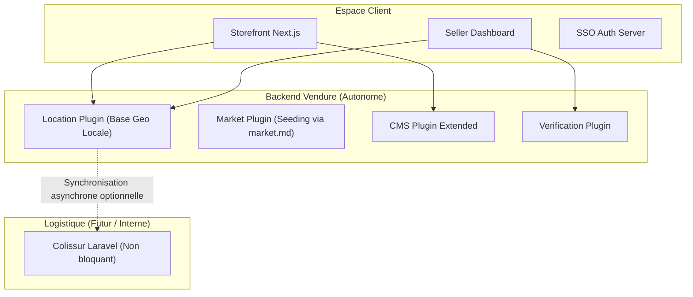
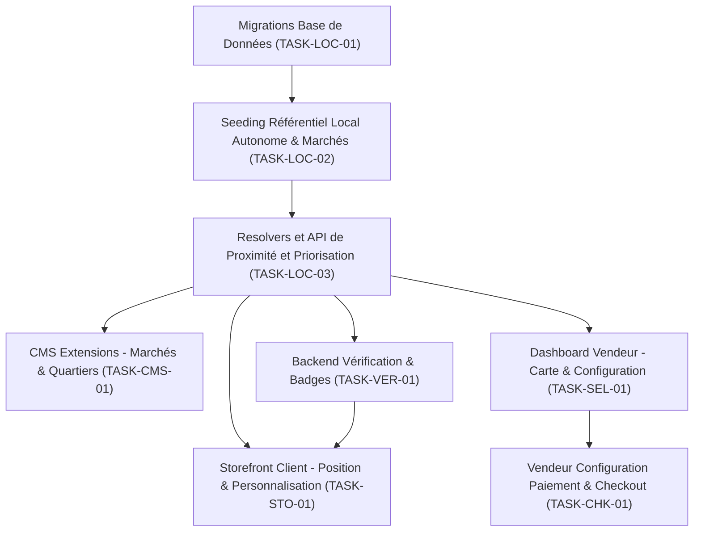

# Plan d'Implémentation Technique & Architecture — Projet Ahizan

Ce document constitue la feuille de route technique complète pour l'intégration de la nouvelle vision produit **Ahizan** (l'infrastructure numérique du commerce béninois) au sein de la base de code existante.

En tant que **Lead Software Architect**, ce plan a été mis à jour suite aux derniers retours concernant l'**intégration des données de marchés (`market.md`)**, la **relation vendeur-marchés**, et les **règles de priorité d'affichage**.

---

## 1. Analyse Complète de l'Existant (Étape 1)

L'architecture actuelle d'Ahizan est modulaire et repose sur les technologies suivantes :
* **Backend (`backend`) :** Un serveur e-commerce **Vendure** (Node.js/TypeScript, TypeORM, PostgreSQL) structuré autour d'API GraphQL (Shop API et Admin API). Il intègre plusieurs plugins personnalisés (`MultivendorPlugin`, `CMSPlugin`, `PageInscriptionPlugin`, etc.).
* **Storefront (`Storefront`) :** Une application client **Next.js 16** (App Router, React 19, Tailwind CSS v4) qui consomme la Shop API de Vendure. La page d'accueil et d'autres pages de contenu sont générées de manière dynamique à partir du `CMSPlugin` en analysant des sections structurées.
* **Dashboard Vendeur (`seller`) :** Une application **Next.js 16** permettant aux vendeurs de gérer leur boutique et leurs produits.
* **Portail Unique SSO (`auth`) :** Une application **Next.js 16** centralisant la connexion et l'inscription (Shared Cookie SSO via le cookie `vendure-auth-token` sur le domaine `.ahizan.com`).
* **Logistique (`colissur`) :** Un backend indépendant en **Laravel** qui gère la logistique. Il dispose d'un modèle géographique (`locations`) structurant les villes, arrondissements et quartiers du Bénin, avec coordonnées GPS, contours géométriques (`bounds`) et statuts d'activation.

### Points clés de l'existant :
1. **Localisation :** Le backend d'Ahizan ne gère actuellement qu'une chaîne de caractères libre `zone` (ex: `"Cotonou - Akpakpa"`) sur l'entité `Vendor`. Il n'y a aucune notion de latitude, longitude, ou de structure géographique hiérarchique dans Vendure.
2. **CMS Builder :** Le `CMSPlugin` gère les pages et les sections via les entités `Page` et `PageSection`. Le Storefront consomme cette API pour restituer des blocs tels que `TABBED_PRODUCT_GRID`, `PRODUCT_GRID` ou `SMART_VISUAL_GRID`. Les pages de marchés et de quartiers sont absentes.
3. **Vérification :** L'entité `Vendor` possède déjà des champs juridiques (`rccmNumber`, `ifuNumber`, `idCardNumber`) et de statut de vérification (`verificationStatus: boolean`), mais aucun workflow progressif n'est implémenté côté vendeur.
4. **Livraison & Paiement :** Le système fonctionne par défaut avec le paiement à la livraison (sans passerelle externe).

---

## 2. Comparaison Vision / Existant (Étape 2)

| Fonctionnalité Visée | État Actuel | Solution Technique Cible / Rationale |
| :--- | :--- | :--- |
| **Hiérarchie géographique** | **Absent** dans Ahizan | Créer un référentiel local autonome dans Ahizan (`LocationPlugin` dans Vendure) pré-peuplé par migration/seed. Ce référentiel s'inspire de la structure de Colissur mais fonctionne de manière 100 % isolée. |
| **Coordonnées GPS Boutique** | **Absent** | Ajouter des colonnes `latitude`, `longitude`, `quartierId` à l'entité `Vendor` de Vendure. |
| **Localisation Client** | **Absent** | Implémenter la détection de position par l'API Geolocation du navigateur sur le Storefront, avec résolution inverse via notre table géographique locale. |
| **Module Marchés** | **Absent** | Créer une entité `Market` liée à une zone géographique et à des boutiques. Utiliser les données du fichier [market.md](file:///srv/ahizan/scratch/market.md) pour peupler la base (seed). Étendre le CMS pour créer dynamiquement les pages de marchés. |
| **Module Quartiers** | **Absent** | Exploiter les données de quartiers autonomes pour générer des pages d'exploration locale. |
| **Recommandations Proximité** | **Absent** | Ajouter un filtre de proximité géospatiale hybride (PostgreSQL) combinant la distance physique et les préférences du profil utilisateur. |
| **Workflow de Vérification** | **Partiel** | Utiliser les champs juridiques existants de l'entité `Vendor` et créer un module d'onboarding avec des badges et animations Lottie. |
| **Modes de Paiement du Vendeur** | **Absent** | Configurer par défaut le paiement à la livraison (non désactivable actuellement). Permettre d'activer d'autres modes à l'avenir depuis le Dashboard Vendeur. |

---

## 3. Analyse des Impacts (Étape 3)

### Localisation & Autonomie Géographique
* **Modules impactés :** `MultivendorPlugin` (extension de `Vendor`), nouveau `LocationPlugin`.
* **Base de données :** Table `geographic_location` contenant le référentiel des villes/arrondissements/quartiers. Elle est pré-peuplée de manière autonome lors du déploiement via un fichier SQL/JSON local (contenant les coordonnées et polygones issus de Colissur) afin d'assurer l'autonomie d'Ahizan en cas d'indisponibilité ou d'instabilité de Colissur.
* **Sécurité :** L'accès à la position GPS du client se fait par HTTPS sécurisé avec consentement explicite.

### Marchés & Quartiers
* **Modules impactés :** Nouveau `MarketPlugin`, extension de `CMSPlugin` pour gérer les types de pages `MARKET` et `NEIGHBORHOOD`.
* **Base de données :** Table `market` (alimentée par le fichier [market.md](file:///srv/ahizan/scratch/market.md)), table de jointure `vendor_markets_market` (relation Many-to-Many), table `page` (nouveaux types).
* **Performances :** Pour éviter de ralentir le chargement, la recherche de produits à proximité utilise un index spatial sur PostgreSQL et une table de cache des distances entre les quartiers de Cotonou.

### Vérification & Gamification
* **Modules impactés :** `MultivendorPlugin` (resolvers), nouveau `VerificationPlugin`.
* **UX/UI :** Intégration d'animations interactives à l'aide de fichiers Lottie (via `@lottiefiles/dotlottie-react` déjà disponible dans le package.json du Storefront et du Seller Dashboard) pour rendre l'onboarding et l'obtention de badges gratifiants.

---

## 4. Repenser l'Architecture (Étape 4)

L'architecture proposée garantit l'**indépendance opérationnelle** d'Ahizan. Le système de Colissur n'intervient à aucun moment dans le workflow critique de checkout, de paiement, ou de recherche d'Ahizan.

### Principes directeurs :
1. **Autonomie géospatiale :** Ahizan possède ses propres tables de localisation. Elles sont peuplées lors de l'initialisation du projet à l'aide d'un seeder indépendant. Si l'API Colissur est stable et en ligne, une tâche planifiée facultative peut synchroniser d'éventuelles nouvelles zones créées côté Colissur, mais en cas de panne de Colissur, Ahizan fonctionne normalement sans aucune interruption.
2. **Technologie Cartographique :** Pour la carte interactive permettant au vendeur de pointer son commerce, nous utiliserons la bibliothèque cartographique **Leaflet** (JavaScript moderne) associée aux tuiles gratuites de **OpenStreetMap** (OSM). Leaflet fournit le moteur interactif de rendu et de gestion des marqueurs tandis qu'OpenStreetMap fournit les fonds de carte géographiques libres, garantissant une intégration moderne, performante et sans frais d'API (contrairement à Google Maps).
3. **Liaison Vendeur <-> Marchés et Priorité d'Affichage :**
   * Un vendeur physique peut, depuis son Dashboard Vendeur, déclarer sa présence physique dans l'un des marchés de la liste (ex: Dantokpa).
   * Il peut également choisir d'associer et d'afficher ses produits dans un ou plusieurs marchés (diffusion multi-marchés).
   * **Algorithme de classement (Ranking) :** Sur la page d'un marché spécifique (ex: Page du marché Missèbo), les produits et boutiques sont ordonnés selon la priorité suivante :
     1. **Priorité 1 :** Les vendeurs résidant physiquement à l'intérieur du périmètre géographique du marché (vendeurs physiques déclarés).
     2. **Priorité 2 :** Les vendeurs situés à proximité immédiate du marché (calcul du rayon de proximité géographique via le `LocationPlugin`).
     3. **Priorité 3 :** Les vendeurs distants ayant choisi d'associer leurs produits au marché pour la diffusion.
4. **Livraison découplée :** Nous maintenons le protocole de livraison actuel géré de gré à gré par le vendeur (ou ses propres livreurs). Nous préparons en interne la base de données de Vendure (champs optionnels et invisibles sur le storefront) pour accueillir les tracking codes de Colissur (`collect_code`, `pickup_code`) afin de rendre l'intégration future triviale sans changer le modèle de données.

---

## 5. Spécifications des Nouveaux Modules (Étape 5)

### A. Module de Localisation (`LocationPlugin`)
* **Responsabilités :** Gérer le référentiel géographique local, valider les positions GPS des boutiques (Leaflet + OSM) et des acheteurs, calculer les distances inter-quartiers.
* **Données manipulées :** `GeographicLocation` (id, name, type [CITY, ARRONDISSEMENT, NEIGHBORHOOD], centerLatitude, centerLongitude, radiusMeters, parentId, isActive).
* **Dépendances :** Base de données PostgreSQL locale.
* **Interfaces GraphQL (Shop/Admin API) :**
  * Query `geographicLocations(type: LocationType, parentId: ID): [GeographicLocation!]!`
  * Query `resolveLocationFromGPS(latitude: Float!, longitude: Float!): GeographicLocation`

### B. Module Marchés (`MarketPlugin`)
* **Responsabilités :** Modéliser les grands marchés, associer les vendeurs et produits aux marchés, et exposer les données pour le rendu des pages.
* **Données manipulées :** `Market` (id, name, slug, description, image, centerLatitude, centerLongitude, radiusMeters, allowedFacetIds).
* **Seeding de Données :** Le fichier [market.md](file:///srv/ahizan/scratch/market.md) sert de source officielle pour pré-remplir la table `Market` de base (Dantokpa, PK3, Ganhi, Cadjèhoun, Gbégamey, Mènontin, Aïdjèdo, Wologuèdè, Tokplégbé, Midombo, Sainte Trinité, Missèbo, Zongo, Ouando, Ahouangbo, Djassin, Godomey, Akassato, Cococodji, Zogbadjè, Glo-Djigbé).

### C. Module Recommandation (`RecommendationPlugin`)
* **Responsabilités :** Retourner des sélections de produits et boutiques personnalisées.
* **Logique hybride :** Les produits proches géographiquement ou appartenant au même quartier sont mis en valeur en priorité dans les blocs de proximité (ex. *"Près de chez vous"*). Cependant, les listes et recommandations générales continuent de proposer des articles hors de la zone de proximité directe basés sur l'historique d'intérêt de l'utilisateur, afin de ne pas restreindre ses choix d'achat.

### D. Module Vérification (`VerificationPlugin`)
* **Responsabilités :** Gérer le parcours progressif d'approbation et l'attribution des badges.
* **Données :** Badges cumulables (Identité vérifiée, Téléphone validé, Boutique OSM confirmée, Vendeur réactif). Déclenchement d'animations Lottie de célébration lors du passage des paliers sur le Dashboard Vendeur.

---

## 6. Évolutions des Modules Existants (Étape 6)

### 1. `MultivendorPlugin` (Backend)
* Ajout de relations `location` (GeographicLocation) et de champs `latitude`/`longitude` sur l'entité `Vendor`.
* Ajout d'une relation Many-to-Many `markets` sur l'entité `Vendor` et d'une colonne `physicalMarketId` (Marché de résidence physique).
* Ajout des options de paiement acceptées par boutique. Par défaut, le paiement à la livraison (Cash on Delivery) est actif d'office et ne peut pas être désactivé par le vendeur (tant que d'autres options de paiement globales comme le Mobile Money ne sont pas disponibles).

### 2. `CMSPlugin` (Backend)
* L'entité `Page` accepte de nouveaux types : `MARKET` et `NEIGHBORHOOD`.
* Le resolver de page génère dynamiquement des instances de page pour les nouveaux marchés ou quartiers en clonant un preset de mise en page par défaut.

### 3. SSO (Portail Unique Auth)
* Le SSO est réajusté pour supporter une logique hybride de redirection :
  * Si la requête de connexion contient un paramètre `redirectTo` (ex: provenance explicite de `seller.ahizan.com`), le SSO authentifie et redirige l'utilisateur directement vers cette destination.
  * Si la requête de connexion est ambiguë ou directe (sans paramètre `redirectTo`), le SSO affiche le tableau de bord de choix (Role Selector) permettant à l'utilisateur de choisir entre accéder à l'espace acheteur (`ahizan.com`) ou à son espace vendeur (`seller.ahizan.com`).

---

## 7. Cartographie des Dépendances Techniques (Étape 7)

### Fondations (Bloquant pour le reste) :
* Les migrations de données géographiques (TASK-LOC-01) et le seeding initial autonome (TASK-LOC-02) doivent être finalisés en premier pour alimenter le moteur de géolocalisation local d'Ahizan.

---

## 8. Ordre Réel d'Implémentation (Étape 8)

1. **[MIGRATIONS]** Création des tables de localisation géographiques (`GeographicLocation`, `Market`) et mise à jour de la table `Vendor` (relations et champs GPS).
2. **[GEO & MARKET SEEDING]** Importation et seeding autonomes de la hiérarchie géographique locale d'Ahizan à l'aide d'un dump SQL/JSON de Cotonou, et seeding de la liste des marchés issus du fichier [market.md](file:///srv/ahizan/scratch/market.md).
3. **[LOCALISATION API]** Création des résolveurs GraphQL pour la recherche de proximité, la priorisation de classement (physique > proximité > diffusion) et le calcul des distances géospatiales.
4. **[CMS EXTENSION]** Adaptation du `CMSPlugin` pour la génération dynamique de pages de type marché ou quartier.
5. **[VERIFICATION BACKEND]** Développement du module d'onboarding, d'upload de pièces juridiques et du calculateur de badges.
6. **[DASHBOARD SELLER UI]** Intégration de la carte interactive (Leaflet + OpenStreetMap) et du formulaire permettant au vendeur d'associer sa boutique à un marché physique et d'associer ses produits à des marchés de diffusion. Intégration des animations Lottie pour la progression.
7. **[STOREFRONT UI]** Intégration de la capture de position utilisateur (prompt / sélection manuelle) et intégration de la logique de recommandation hybride (proximité + intérêts).
8. **[CHECKOUT & PAIEMENTS]** Ajout des paramètres de modes de paiement pour les vendeurs (paiement à la livraison par défaut non désactivable) et mise à jour du checkout.

---

## 9. Roadmap Technique Détaillée (Étape 9)

### Phase 1 — Fondations Géographiques & Marchés
* **Objectif :** Disposer d'un moteur de localisation fonctionnel, d'un référentiel géographique local autonome et pré-peuplé, ainsi que de la base de données des marchés officiels.
* **Livrables :** `LocationPlugin` backend, seeders géographiques locaux (villes/quartiers) et des marchés (via `market.md`), API GraphQL de recherche de proximité, tables de cache des distances entre arrondissements/quartiers.
* **Risques :** Erreurs de classement spatial.
* *Mitigation :* Écriture de tests unitaires simulant des positions GPS pour valider le classement de priorité (1. Résidents du marché, 2. Proches du marché, 3. Associés au marché).

### Phase 2 — Écosystèmes Marchés & Quartiers
* **Objectif :** Déployer les pages de Marchés et de Quartiers pilotées par le CMS.
* **Livrables :** Pages dynamiques `/market/[slug]` et `/neighborhood/[id]` sur le Storefront, intégration de ces nouvelles pages dans le CMS Admin.

### Phase 3 — Parcours de Confiance & Gamification
* **Objectif :** Lancer le workflow d'onboarding cartographique et le système de badges de vérification des vendeurs.
* **Livrables :** Assistant d'inscription vendeur mis à jour avec carte Leaflet/OSM, tableau de bord des badges sur le Dashboard avec animations Lottie, affichage des badges sur le Storefront.

### Phase 4 — Tunnel d'Achat & Préparation Colissur
* **Objectif :** Gérer les modes de paiement vendeurs et préparer techniquement l'intégration de Colissur.
* **Livrables :** Checkout dynamique prenant en compte les méthodes de paiement choisies par le vendeur, base de données préparée (champs de tracking logistiques optionnels) pour l'intégration de Colissur lorsqu'elle sera jugée stable.

---

## 10. Décomposition en Tâches (Étape 10)

### 🎫 TASK-LOC-01 : Création du Modèle de Données Géographiques (Vendure)
* **Objectif :** Implémenter les structures de données nécessaires pour la géolocalisation.
* **Description :** Créer l'entité `GeographicLocation` et l'associer à l'entité `Vendor`. Ajouter les champs `latitude`, `longitude` sur le vendeur.
* **Modules concernés :** `backend` (TypeORM).
* **Critères de réussite :** Les tables sont générées avec succès par les migrations et la relation Vendeur <-> Localisation est opérationnelle.

### 🎫 TASK-LOC-02 : Seeder Référentiel Local Autonome & Marchés
* **Objectif :** Peupler de manière autonome le référentiel des localisations géographiques et des marchés.
* **Description :** Écrire un script d'initialisation de base de données (seeder) qui insère les villes/quartiers du Bénin ainsi que les 21 marchés détaillés dans [market.md](file:///srv/ahizan/scratch/market.md) avec leurs spécificités.
* **Modules concernés :** `backend`.
* **Critères de réussite :** L'exécution du seeder remplit la table locale `GeographicLocation` et la table `Market` sans nécessiter d'appel réseau extérieur.

### 🎫 TASK-LOC-03 : Requêtes de Proximité GraphQL & Classement de Priorité
* **Objectif :** Permettre le filtrage spatial des vendeurs et la priorisation d'affichage.
* **Description :** Ajouter des filtres géospatiaux à la requête `vendors` et au resolver de recherche de produits. Implémenter le tri : 1. Vendeurs résidents du marché (Many-to-Many relation), 2. Vendeurs géographiquement proches, 3. Vendeurs associés de diffusion.
* **Modules concernés :** `backend` (Resolvers de recherche).

### 🎫 TASK-CMS-01 : Support des Pages Marchés et Quartiers dans le CMS
* **Objectif :** Rendre les pages de marchés administrables.
* **Description :** Modifier `CMSPlugin` pour accepter les types de pages `MARKET` et `NEIGHBORHOOD`. Mettre en place un résolveur de page dynamique qui renvoie les sections du preset correspondant au marché demandé.
* **Modules concernés :** `backend` (`CMSPlugin`), `Storefront` (App Router).

### 🎫 TASK-UI-01 : Détection de Position Client & Personnalisation (Storefront)
* **Objectif :** Capter la position de l'acheteur et adapter l'affichage de manière hybride.
* **Description :** Intégrer un prompt Geolocation API et un sélecteur manuel de quartier. Si accepté, adapter la page d'accueil pour n'afficher en priorité les produits et boutiques proches dans les sections configurées du CMS, tout en continuant à proposer des recommandations globales (intérêts/popularité) pour ne pas limiter l'utilisateur.
* **Modules concernés :** `Storefront`.

### 🎫 TASK-SEL-01 : Assistant d'Onboarding & Carte Leaflet / OSM (Vendeur)
* **Objectif :** Permettre au vendeur de se localiser précisément.
* **Description :** Intégrer la carte interactive **Leaflet** alimentée par les tuiles de **OpenStreetMap** sur le formulaire de création/modification de boutique. Permettre au vendeur de cliquer sur la carte pour enregistrer ses coordonnées GPS précises, d'associer sa boutique à un marché physique de résidence, de sélectionner des marchés secondaires de diffusion pour ses produits, et d'uploader ses pièces justificatives (avec animations Lottie pour guider la progression de la vérification).
* **Modules concernés :** `seller` (Dashboard Vendeur).

### 🎫 TASK-CHK-01 : Configuration des Modes de Paiement du Vendeur
* **Objectif :** Permettre au vendeur de choisir ses modes de paiement acceptés.
* **Description :** Ajouter une section dans les paramètres du dashboard vendeur pour activer les méthodes de paiement. Par défaut, le paiement à la livraison (Cash on Delivery) est actif et obligatoire. Les autres options (Mobile Money, Virement) pourront être activées ultérieurement.
* **Modules concernés :** `backend` (resolvers), `seller`.

---

## 11. Détection des Incohérences de la Vision Produit (Étape 11)

### 🚨 Incohérence 1 : Dépendance bloquante sur un système externe instable (Colissur)
* **Le problème :** La vision produit d'origine propose d'intégrer étroitement la livraison avec Colissur dès les premières étapes. Le système logistique Colissur n'étant pas encore jugé stable pour la production, une dépendance directe paralyserait Ahizan en cas de panne de Colissur.
* **Alternative proposée :** Assurer l'**autonomie complète d'Ahizan**. La livraison reste gérée par le vendeur et le paiement se fait à la livraison par défaut. Les API Colissur ne sont jamais appelées de manière synchrone durant la navigation ou le checkout. L'intégration avec Colissur se fera de manière invisible en arrière-plan (Phase 4) lorsque le système sera validé comme stable.

### 🚨 Incohérence 2 : Caching des Pages Dynamiques (Performances)
* **Le problème :** Personnaliser l'intégralité du Storefront (la page d'accueil et les grilles de produits) en fonction de la position GPS précise de chaque visiteur empêche l'utilisation du cache de page (SSG/ISR) au niveau de Next.js. Cela forcerait un rendu côté serveur (SSR) complet pour chaque requête, dégradant les performances.
* **Alternative proposée :** La structure globale de la page d'accueil (CMS) reste statique et mise en cache. Les blocs de produits et de boutiques (ex: *"Près de chez vous"*) sont chargés **côté client** (Client-Side Rendering via des requêtes GraphQL asynchrones utilisant `SWR` ou `React Query`) une fois la position détectée ou déclarée.

### 🚨 Incohérence 3 : Redirection SSO trop intrusive
* **Le problème :** Forcer un écran de sélection de rôle à chaque connexion SSO ajoute une friction inutile pour l'utilisateur qui souhaite simplement naviguer sur le site client.
* **Alternative proposée :** Le SSO redirige en priorité vers l'application d'origine (Storefront ou Seller Dashboard) via le paramètre `redirectTo`. Le sélecteur de rôle n'est affiché que si la connexion est initiée directement sur la page d'accueil du SSO ou si la destination est ambiguë.

---

## 12. Opportunités d'Amélioration & Optimisations (Étape 12)

### 💡 1. Caching des distances géographiques (Performance)
Le calcul des distances entre les boutiques et l'acheteur est gourmand en CPU. Nous devons mettre en place une table de cache des distances entre quartiers (ex: la distance entre Cadjèhoun et Akpakpa est constante). Lorsque l'acheteur déclare être dans le quartier A, les produits des boutiques situées dans le quartier B voient leur distance résolue instantanément en cache, sans calcul trigonométrique en base de données.

### 💡 2. Progressive Web App (PWA) Offline-First pour les Vendeurs
Les connexions internet des vendeurs au marché (ex: Dantokpa) sont instables. Nous devrions exploiter le service worker existant sur le Dashboard Vendeur pour permettre la saisie de fiches produits et la consultation des commandes hors-ligne, avec synchronisation automatique dès que le réseau est rétabli.

---

## 13. Plan de Vérification (Verification Plan)

### Tests Automatisés
* **Tests unitaires sur le calcul de distance et priorité de tri :** Valider que la formule de distance et l'algorithme de classement trient correctement les produits (Résidents du marché > Proches > Diffusés secondaires).
* **Simulation d'un import geo :** Tester l'intégrité du script de seeding de la table géographique avec les données locales de Cotonou et les marchés issus de `market.md`.

### Vérification Manuelle
1. **Validation Onboarding Vendeur :** Créer un compte vendeur, placer un point sur la carte interactive (Leaflet + OpenStreetMap) du dashboard, associer la boutique physiquement au Marché "Dantokpa" et associer les produits à "PK3" pour la diffusion. S'assurer que le tout est correctement sauvegardé localement.
2. **Validation Exploration Marché Client :** Consulter la page du marché "Dantokpa", vérifier que les boutiques physiquement localisées à Dantokpa apparaissent en haut de la liste, suivies des boutiques à proximité directe (ex: Akpakpa), puis de celles associées uniquement en diffusion secondaire.
3. **Simulation de Paiement :** Effectuer une commande de test, s'assurer que le mode de paiement sélectionné est bien le paiement à la livraison (activé par défaut chez le vendeur) et que la commande se finalise sans aucune erreur.
